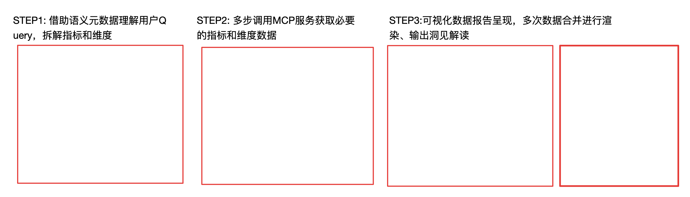

# 2604 语义平台生产&消费先进性

# 一、 语义生产侧：从"写代码"到"写配置"的范式跃迁

### 1.1 语义建模：YAML声明式建模

传统ETL模式下，新增一个指标意味着新增一条ETL任务链路。大宽表模式虽然可以复用已有字段，但跨主题的新增字段仍需回流ETL变更，开发周期以天为单位。

语义平台2.0采用YAML声明式定义，将指标生产从"工程任务"降级为"配置任务"。以**零售医药订单域**为例，中间层数仓同学完成资产梳理后，可通过AI辅助创建，使用语义模型Skill（metric-yaml-builder）将资产梳理结果直接输入，AI自动生成符合规范的YAML文件。建模完成后通过平台"导入数据模型"功能批量导入，平台自动进行格式校验、命名规范检查和语义冲突检测。

| 差异项 | Before（传统ETL） | After（语义平台2.0） |
|---------|---------------------|--------------------------|
| 定义方式 | ETL脚本 + 元数据注册 + 维度管理系统，分散在3+系统 | 一份YAML文件，声明式定义全部语义 |
| 新增维度 | 回到ETL加字段→跑数据→注册维度 | YAML中加一段expression，分钟级生效 |
| 维度值域 | 人工维护映射表或文档，AI无法自动理解 | value_space直接写入YAML，AI自动映射 |
| 维度时间对齐 | ETL中硬编码JOIN逻辑，SCD问题反复踩坑 | temporal_policy一行声明（point_in_time/latest/offset-N） |
| AI可理解性 | 无，AI需自行猜测字段含义 | ai_context内嵌synonyms+instructions，AI原生可读 |

整个过程也从传统的"**周级工程"缩短为"天级配置"**，下面是一个完整的语义模型定义，包括事实表、维表、原子指标、多个维度（含枚举值域、时间配置、表达式类维度）：

```yaml
semantic_model:
  - name: alsc_order_model
    description: 订单域语义模型
    ai_context:
      instructions: "用于查询订单相关的数据，比如：近一天有效订单数是多少、各城市的净GMV是多少等."

    datasets:
      # 事实表：订单明细
      - name: dwd_ele_trd_item_order_di
        source: alsc_cdm.dwd_ele_trd_item_order_di
        primary_key: [order_id]
        description: 订单明细表
        is_fact: true

        # 原子指标：直接在事实表上定义
        metrics:
          - name: ord_cnt
            title: 有效订单数
            type: atomic
            unit: 笔
            data_type: bigint
            aggregation:
              expression: count(case when is_valid_order = 1 then order_id end)
            description: 有效订单数，剔除无效单
            ai_context:
              synonyms:
                - "单量"

        # 维度：直接在事实表上定义
        dimensions:
          - name: is_group_order
            title: 是否爆品团订单
            expression: is_group_order
            value_space:
              values:
                - value: 1
                  desc: 是
                - value: 0
                  desc: 否
            temporal_policy:
              type: "point_in_time"  # 历史对齐历史
            ai_context:
              synonyms:
                - "bpt"

          # 表达式类维度：无需额外ETL，直接在YAML中声明计算逻辑
          - name: order_layer
            title: 笔单分层
            expression: |
              case 
              when pay_amt < 1500 then '低笔单' 
              when pay_amt >= 1500 and pay_amt < 3000 then '中笔单'
              else '高笔单' end

          - name: ds
            title: 业务日期
            expression: ds
            time_config:
              time_granularity: day
              format: "yyyyMMdd"

      # 维表：自动关联
      - name: dim_ele_shop
        source: alsc_cdm.dim_ele_shop
        primary_key: [shop_id]
        description: 商户维表
        is_fact: false
        dimensions:
          - name: shop_name
            title: 商户名称
            expression: shop_name
          - name: bu_flag
            title: 业务线
            expression: bu_flag
```

### 1.2 指标生产：衍生指标零开发成本（NoETL）

语义平台的核心能力之一是NoETL——仅需定义原子指标，系统根据配置推导衍生指标和复合指标，无需额外的ETL开发。以下是6类典型派生指标的YAML定义：

| 场景 | Before（传统ETL） | After（语义平台 YAML） |
|------|---------------------|----------------------------|
| **原子指标** 有效订单数 | 编写ETL脚本SUM/COUNT → 注册调度 → 配告警 | aggregation: expression: count(...) 一行 |
| **派生指标** 近7天爆品团订单数 | 新建调度任务 → 写SQL 7天窗口 → WHERE过滤 → 结果表 | 9行YAML（见下方示例1），分钟级 |
| **日均值** 近7天日均订单量 | 两层聚合SQL + 中间表，1天 | time_agg: daily_avg 一个参数（示例2） |
| **同环比** 日环比增长率 | LAG窗口函数 + 空值/除零处理，每报表各写一遍 | comparison_type: dod_growth_rate 一行（示例3） |
| **排名** 门店商圈排名 | PARTITION BY窗口函数 + 手动约束查询维度 | method: ranking + scope/dimension声明式（示例4） |
| **占比** 商户商圈占比 | 子查询/JOIN控制分子分母粒度，易写错 | method: ratio + ratio_dimension/scope（示例5） |
| **复合指标** 爆品团订单占比 | 新增ETL + 除法逻辑 + 口径管理分散 | expression: a / b + input_metrics显式依赖（示例6） |

**After 示例 YAML 片段：**

```yaml
# 示例1：派生指标 - 近7天爆品团有效订单数
- name: bpt_ord_cnt_7d
  title: 近7天_爆品团_有效订单数
  type: derived
  input_metric: ord_cnt
  time_constraint: { time_range: latest_7d, time_agg: total }
  business_filter:
    conditions:
      - field: is_group_order
        operator: "="
        value: 1

# 示例2：日均值 - 近7天日均订单量
- name: daily_avg_ord_cnt_7d
  title: 近7天_日均订单量
  type: derived
  input_metric: ord_cnt
  time_constraint: { time_range: latest_7d, time_agg: daily_avg }

# 示例3：同环比 - 日环比增长率
- name: ord_cnt_dod_growth_rate
  title: 有效订单数_日环比增长率
  type: derived
  input_metric: ord_cnt
  time_constraint: { time_range: latest_1d, time_agg: total }
  derivation: { method: comparison, comparison_type: dod_growth_rate }

# 示例4：排名 - 门店商圈排名
- name: shop_ord_cnt_aoi_rank
  title: 门店订单数_商圈排名
  type: derived
  input_metric: ord_cnt
  time_constraint: { time_range: latest_1d, time_agg: total }
  derivation:
    method: ranking
    rank_scope: [aoi_id]
    rank_dimension: [shop_id]
    rank_function: rank
    rank_order: desc

# 示例5：占比 - 商户商圈占比
- name: shop_ord_cnt_aoi_ratio
  title: 商户订单量_商圈占比
  type: derived
  input_metric: ord_cnt
  time_constraint: { time_range: latest_1d, time_agg: total }
  derivation:
    method: ratio
    ratio_dimension: [shop_id]
    ratio_scope: [aoi_id]

# 示例6：复合指标 - 爆品团订单占比
- name: bpt_ord_rate
  title: 爆品团订单占比
  type: composite
  expression: bpt_ord_cnt_7d / ord_cnt_1d
  input_metrics:
    - name: bpt_ord_cnt_7d
    - name: ord_cnt_1d
```

### 1.3 指标治理：定义即血缘

基于ADS应用层10万+张表构建语义，指标口径散落在各张定制化宽表中。语义平台2.0将语义锚点下沉到DWD/DWS中间层，资产数量仅千级别，天然适合统一语义定义。

| 差异项 | Before（大宽表/ ADS层） | After（中间层） |
|---------|-----------------------------|--------------------|
| 语义锚点 | ADS应用层10万+张定制化宽表 | DWD/DWS中间层，千级别表 |
| 治理对象规模 | 10万+级，O(n²)级治理成本 | 千级别，治理复杂度降低两个数量级 |
| 口径一致性 | 同一指标散落多张宽表，口径不一致是常态 | Single Source of Truth，单点定义 O(1) |
| 协作模式 | 各团队各建宽表，缺乏标准 | 中间层定义原子语义，应用层定义派生/复合指标 |
| 可复用性 | 宽表面向特定场景，跨场景复用难 | 一套原子语义，上层可派生无数消费场景 |

同时，在传统ETL模式下，指标血缘依赖调度系统，指标级血缘需额外开发。语义平台2.0通过YAML声明，实现"**定义即血缘**"——以复合指标`bpt_ord_rate`为例，其`input_metrics`显式声明了对`bpt_ord_cnt_7d`和`ord_cnt_1d`的依赖，而`bpt_ord_cnt_7d`又通过`input_metric`声明了对原子指标`ord_cnt`的依赖，整条血缘链路在YAML中一目了然：

```
bpt_ord_rate (复合指标)
  ├── bpt_ord_cnt_7d (派生指标: 近7天+爆品团)
  │     └── ord_cnt (原子指标: 有效订单数)
  │           └── dwd_ele_trd_item_order_di (事实表)
  └── ord_cnt_1d (派生指标: 近1天)
        └── ord_cnt (原子指标: 有效订单数)
              └── dwd_ele_trd_item_order_di (事实表)
```

同时YAML文件天然支持Git版本管理，指标口径变更可diff/回滚，变更历史完全可审计。

### 1.4 指标全生命周期管理

语义平台2.0覆盖指标从需求到下线的完整生命周期，每个阶段相比传统模式均有一定提效：

| 生命周期阶段 | Before（传统ETL） | After（语义平台2.0） |
|------------------|---------------------|--------------------------|
| 需求提出 | 业务方提需求 → 数据团队排期 | 业务方自助查阅指标目录，需求澄清缩短50% |
| 口径定义 | 编写SQL定义，门槛高 | YAML声明式表达式，门槛从"会SQL"降到"懂业务" |
| 开发实现 | 编写ETL脚本，天级别 | YAML配置无需编码，工作量减少90%+ |
| 测试验证 | 手工编写测试用例，覆盖率约30% | YAML驱动自动测试，覆盖率90%+ |
| 上线部署 | 注册调度系统 | 导入即生效，从"调度操作"变为"配置提交" |
| 口径变更 | 改代码 → 重测 → 重上线 | 改YAML → 通知下游消费者 |
| 指标下线 | 人工确认无下游依赖 | 平台自动追踪引用，数据驱动的生命周期管理 |
| 血缘追溯 | 依赖调度系统，指标级血缘需额外开发 | 定义即血缘，YAML天然支持Git版本管理 |
| 版本管理 | 代码版本 ≠ 口径版本，难以diff | YAML文件天然支持diff/回滚，变更历史完全可审计 |

# 二、语义消费侧：语义层驱动的数据消费范式升级

| 进阶层级 | 对比维度 | 宽表模式(Before) | 语义模式(After) | 核心价值 |
|------------|------------|--------------------|-------------------|------------|
| 建设范式 | 架构模式 | 烟囱式：各消费场景独立建表，重复建设 | 复用式：一套语义定义多端共享，新增场景边际成本趋近于0 | 降低重复建设成本，提升资产复用率 |
|  | 维度能力 | 预设维度：数据预埋有限组合，仅支持已知查询 | 按需维度：全量语义维度自由组合，支撑探索性分析 | 从有限枚举到指数级组合，释放分析潜力 |
| 服务能力 | 消费门槛 | 面向表：找表→理解字段→写SQL→出数，需技术能力 | 面向语义：选指标→选维度→选算子，懂业务即可 | 从技术门槛到业务理解，扩大消费人群 |
|  | 计算治理 | 裸SQL：同环比/占比等计算场景各自实现，逻辑重复易出错 | 算子抽象：标准算子编排，复杂度下沉平台侧统一解决 | 从分散实现到平台沉淀，保障口径一致 |
| AI+BI一致性 | 驱动方式 | 人驱动：AI需逆向理解表结构/字段/JOIN才能写SQL，极易出错 | AI可驱动：指标目录/维度关系/算子以结构化协议暴露，AI专注语义理解 | 打通AI消费数据最后一公里，实现人机同权 |
|  | 消费体验 | 人与AI割裂：人用BI工具，AI需单独适配底层数据 | 人与AI同源：共享同一套语义层，BI与AI消费体验一致 | 实现BI看板与AI问答的口径统一、体验一致 |
| 过程透明 | 口径管理 | 黑盒：口径固化在ETL/报表SQL中，修改无记录、下游无感知 | 白盒：口径统一声明于语义层，版本化留痕 | 从不可见、不可控到统一治理 |
|  | 过程溯源 | 难审计：问题数据难定位根因，变更影响面难评估 | 全链路可追溯：每条结果可追溯计算逻辑与数据来源 | 从黑盒状态到变更可审计、消费可解释 |

**消费侧 Before / After 代码对比：**

```sql
-- Before：每个报表各写一遍的同环比SQL
SELECT ds, ord_cnt,
       LAG(ord_cnt, 1) OVER (ORDER BY ds) as yesterday_cnt,
       (ord_cnt - LAG(ord_cnt, 1) OVER (ORDER BY ds))
         / NULLIF(LAG(ord_cnt, 1) OVER (ORDER BY ds), 0) as dod_rate
FROM ...
```

```yaml
# After：引用已定义的派生指标，BI/API/AI Agent结果完全一致
- name: ord_cnt_dod_growth_rate   # 一次定义，处处消费
```

**AI上下文三层配置（After独有）：**

```yaml
# 模型级：告诉AI这个模型能回答什么
ai_context:
  instructions: "用于查询订单数据，如近一天有效订单数、各城市净GMV等."

# 指标/维度级：告诉AI用户可能怎么说
ai_context:
  synonyms: ["单量", "bpt"]

# 维度值域：告诉AI维度值的业务含义
value_space:
  values:
    - value: 1
      desc: 是    # AI自动将"爆品团订单"映射为 is_group_order = 1
```

> USECASE:"昨天海王集团的医药有效订单、净GMV按照城市+集团分组，同时获取同环比以及维度汇总情况, 帮我选取合适的图表进行展示"


