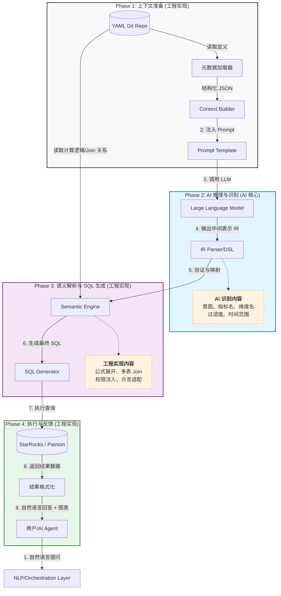

# YAML文件如何使用

这是一个非常清晰的架构落地问题。要构建一个**基于 YAML 语义层的 AI 取数系统**，核心在于明确**"静态配置（YAML）"**、**"AI 推理（LLM）"**和**"工程执行（Engine）"**三者之间的边界和协作流程。

以下是完整的**数据流全景图**及**职责划分**。

---

### 一、完整数据流全景图 (The End-to-End Flow)



---

### 二、详细步骤拆解：谁做什么？

#### 阶段 1：上下文准备 (Context Preparation)

**👉 主导者：工程&算法实现 (Backend/LLM)**
**👉 输入：YAML 文件**
**👉 输出：精简后的 Prompt Context**
- **工程动作**：
    1. **解析 YAML**：服务启动时或按需读取 `domains/`, `shared_models/`, `metrics/` 下的 YAML 文件。
    2. **提取元数据**：只提取 AI 需要的信息（指标名、别名、描述、维度列表、示例问题），**剔除**复杂的 SQL 公式、Join 逻辑、密码等敏感信息。
    3. **构建 Schema**：将提取的信息转换为 LLM 易读的 JSON 或 Markdown 格式。
    4. **动态过滤**：根据当前用户身份，预先过滤掉无权访问的指标（行级/列级权限预检）。
- **YAML 的作用**：提供"字典"和"说明书"。
    - *利用字段*：`name`, `aliases`, `description`, `tags`, `ai_examples`.

#### 阶段 2：AI 识别与意图理解 (AI Recognition)

**👉 主导者：AI (LLM)**
**👉 输入：用户问题 + 工程准备的 Context**
**👉 输出：标准化的中间表示（DSL） (Intermediate Representation, IR)**
- **AI 的核心任务（必须识别的内容）**：
    1. **指标映射 (Metric Resolution)**：
        - 用户说："看下**营收**" -> AI 识别为 YAML 中定义的 `gmv_total` (通过 `aliases` 匹配)。
    2. **维度识别 (Dimension Resolution)**：
        - 用户说："按**城市**拆分" -> AI 识别为 `dim_city.city_name`。
    3. **时间解析 (Time Parsing)**：
        - 用户说："**上个月**" -> AI 识别为标准时间范围 `{ start: '2023-10-01', end: '2023-10-31' }` 或相对时间表达式 `last_month`。
    4. **过滤条件提取 (Filter Extraction)**：
        - 用户说："只要**北京**的**已支付**订单" -> AI 识别为 `city='Beijing' AND status='paid'`。
        - *注意*：AI 只需要知道字段值和逻辑运算符，不需要知道底层表结构。
    5. **意图分类**：是查数？还是归因分析？还是预测？
- **AI 的输出格式 (示例 JSON)**：

```json
{
  "intent": "query_metrics",
  "metrics": ["gmv_total"],
  "dimensions": ["city_name"],
  "filters": [
    {"field": "city_name", "op": "=", "value": "Beijing"},
    {"field": "status", "op": "=", "value": "paid"} 
  ],
  "time_range": {"granularity": "month", "relative": "last_1"}
}

```

#### 阶段 3：语义解析与 SQL 生成 (Semantic Resolution)

**👉 主导者：工程实现 (Semantic Engine)**
**👉 输入：AI 输出的 IR + YAML 中的逻辑定义**
**👉 输出：可执行的物理 SQL**
- **工程动作（AI 做不到的事）**：
    1. **公式展开**：
        - 读取 YAML 中 `gmv_total` 的定义：`sum(amount) WHERE status='paid'`。
        - 将 AI 的简单请求替换为完整的计算逻辑。
    2. **路径规划与 Join 组装**：
        - 发现 `gmv_total` 在 `sales` 域，`city_name` 在 `users` 域。
        - 读取 YAML 中的 `shared_models` 或 Join Graph，自动生成 `JOIN users ON sales.user_id = users.id`。
        - **这是最关键的一步**：AI 不知道表怎么连，引擎负责根据 YAML 定义的图谱自动拼接。
    3. **时间智能转换**：
        - 将 `last_month` 转换为具体的 SQL 日期函数（如 `DATE_TRUNC('month', NOW()) - INTERVAL '1 month'`）。
    4. **安全注入**：
        - 强制追加 YAML 中定义的 RLS 规则（如 `AND dept_id = 'current_user_dept'`）。
    5. **方言适配**：
        - 将通用逻辑翻译成 StarRocks 特有的 SQL 语法。
- **YAML 的作用**：提供"计算器"和"地图"。
    - *利用字段*：`type_params`, `formula`, `joins`, `security_rules`.

#### 阶段 4：执行与后处理 (Execution & Post-processing)

**👉 主导者：工程实现**
**👉 输入：物理 SQL**
**👉 输出：最终答案**
- **工程动作**：
    1. **查询执行**：发送 SQL 到 StarRocks/Paimon。
    2. **异常处理**：如果 SQL 报错（如除以零），捕获错误并让 LLM 生成友好的解释。
    3. **可视化推荐**：根据数据特征（时间序列 vs 分类对比），自动推荐图表类型。
    4. **自然语言总结**：将数据结果再次发给 LLM，生成"上个月北京 GMV 为 100 万，环比增长 5%"这样的结论。

---

### 三、职责边界总结表

| 环节 | **AI (LLM) 的职责** | **工程 (Engine) 的职责** | **YAML 的角色** |
|------|----------------------|-----------------------------|------------------|
| **理解** | 理解自然语言歧义，识别业务术语（同义词）。 | 加载 YAML，清洗元数据，构建 Prompt。 | 提供术语表 (`aliases`) 和描述 (`description`)。 |
| **映射** | 将"营收"映射到 `gmv` 指标 ID。 | 验证映射是否存在，报错未知指标。 | 定义指标 ID 和名称。 |
| **逻辑** | **不负责**计算公式，**不负责**表关联。 | **负责**展开计算公式，**负责**自动 Join 多表。 | 存储公式 (`formula`) 和关联关系 (`joins`)。 |
| **时间** | 识别"上周"、"去年同期"等概念。 | 将其转换为具体的 SQL 日期函数。 | 定义时间粒度支持。 |
| **安全** | **不可信**，不能依赖 AI 做权限判断。 | 强制注入行级/列级权限过滤。 | 定义安全规则 (`access_rules`)。 |
| **执行** | 不直接连接数据库。 | 执行 SQL，处理缓存，格式化结果。 | 无。 |

---

### 四、关键代码逻辑示意 (Python Pseudo-code)

为了让你更直观地理解工程如何实现，这里有一个简化的处理流程：

```python
def ai_query_flow(user_question, user_context):
    # 1. [工程] 加载 YAML 元数据 (仅提取 AI 需要的部分)
    # 从 domains/, shared_models/ 解析 YAML
    semantic_schema = load_yaml_metadata(include=['name', 'aliases', 'desc', 'dims'])
    
    # 2. [工程] 构建 Prompt
    prompt = build_prompt(
        question=user_question,
        schema=semantic_schema,
        examples=get_few_shot_examples() # 来自 YAML ai_context
    )
    
    # 3. [AI] 调用 LLM 获取中间表示 (IR)
    llm_response = call_llm(prompt)
    # 假设返回: {"metrics": ["gmv"], "dims": ["city"], "filters": [...]}
    ir = parse_json(llm_response)
    
    # 4. [工程] 语义解析与 SQL 生成 (核心黑盒)
    # 读取 YAML 中的完整逻辑定义
    full_definitions = load_full_yaml_logic() 
    
    try:
        # 4.1 验证指标是否存在
        validate_metrics(ir.metrics, full_definitions)
        
        # 4.2 自动组装 Join 路径 (基于 YAML 中的 joins 定义)
        join_graph = build_join_graph(full_definitions)
        required_tables = find_tables_for_metrics_and_dims(ir.metrics, ir.dims)
        join_sql_snippet = generate_join_sql(required_tables, join_graph)
        
        # 4.3 展开指标公式 (替换 ref('xxx') 为实际 SQL)
        select_clause = expand_metric_formulas(ir.metrics, full_definitions)
        
        # 4.4 注入时间逻辑和安全规则
        where_clause = build_where_clause(ir.filters, ir.time_range)
        security_clause = inject_rls_rules(user_context, full_definitions)
        
        final_sql = f"SELECT {select_clause} FROM {join_sql_snippet} WHERE {where_clause} AND {security_clause}"
        
    except SemanticError as e:
        return f"抱歉，我无法理解您的请求：{e}"

    # 5. [工程] 执行查询
    data = starrocks_client.execute(final_sql)
    
    # 6. [AI+ 工程] 生成回答
    answer = llm_summarize(user_question, data)
    
    return {"sql": final_sql, "data": data, "answer": answer}

```

### 五、核心结论
1. **YAML 是桥梁**：它把**人类语言**（通过 AI 识别）和**机器逻辑**（通过工程执行）连接起来。
2. **AI 只做翻译，不做计算**：AI 的任务是把"人话"翻译成"标准的指标 ID 和过滤条件"。千万不要让 AI 去写 `SUM(a)/COUNT(b)` 这种 SQL，也不要让 AI 去猜表怎么 Join。
3. **工程兜底逻辑与安全**：所有的计算公式、表关联、权限控制，必须严格从 YAML 中读取并由引擎执行，确保**确定性**和**安全性**。

这套流程确保了：**AI 足够灵活（能听懂各种问法），而数据足够严谨（计算逻辑永远可控）。**
