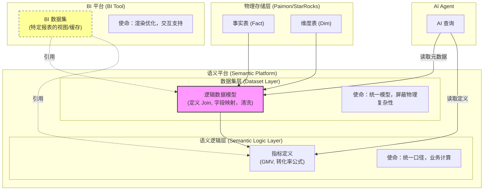

# 域数据集：语义平台数据集 非 BI平台数据集

- **BI 平台的数据集**：通常指 BI 工具（如 PowerBI, Tableau, FBI）内部构建的、面向特定报表的**私有数据模型**。
- **语义平台的数据集层**：指语义平台中负责**连接物理表、定义关联关系（Join）、清洗字段、形成逻辑宽表结构**的那一层（例如 Cube.js 的 `Data Model`，dbt 的 `Models`，或者 StarRocks 的 `View`）。它**尚未包含**复杂的业务指标公式（那是上一层的事），但它定义了"表长什么样"以及"表之间怎么连"。

以下是这两者的深度对比：

---

### 一、核心区别对照表

| 维度 | **BI 平台的数据集** | **语义平台的数据集层 (Dataset Layer)** |
|------|-------------------------|-----------------------------------------------|
| **定位** | **应用级/报表级**的临时或专用数据视图。 | **企业级/域级**的标准化逻辑数据模型。 |
| **覆盖范围** | **局部**。通常只为满足当前几个报表的需求，字段和表关系是裁剪过的。 | **全局**。覆盖整个业务主题域（如"销售域"），包含该域下所有原子字段和完整关联。 |
| **关联逻辑 (Joins)** | **硬编码且封闭**。Join 逻辑写在 BI 引擎内部，其他系统无法复用。 | **标准化且开放**。定义通用的主外键关系（Star Schema），供 BI、AI、API 共同使用。 |
| **字段处理** | **展示导向**。常包含重命名、隐藏无用列、前端格式化（如日期显示格式）。 | **语义导向**。专注于类型统一、空值处理、业务别名映射，为上层计算做准备。 |
| **复用性** | **极低**。A 报表的数据集不能直接给 B 报表用，导致重复建设。 | **极高**。一次定义，被多个 BI 报表、多个 AI Agent、多个 API 同时引用。 |
| **AI 可见性** | **不可见/黑盒**。AI 很难穿透 BI 工具去理解其内部的数据集结构。 | **完全可见**。作为元数据的一部分，直接暴露给 LLM，告诉 AI"有哪些表、怎么连、字段含义"。 |
| **生命周期** | **随报表生灭**。报表下线，数据集往往也被废弃。 | **长期稳定**。作为企业数据资产，独立于具体应用存在。 |

---

### 二、承载使命的差异

#### 1. BI 平台数据集的使命：**"最后一公里"的交付优化**

它的核心任务是**让特定的报表渲染得更快、交互更流畅**。
- **场景化裁剪**：为了加速，它可能只选取了需要的 20 个字段，过滤掉了 80% 的历史数据。
- **前端适配**：它可能已经预处理好了一些适合图表展示的格式（如将时间戳转为"2023-Q1"字符串）。
- **交互状态保持**：它可能包含了支持"下钻"、"联动"所需的中间层级数据。
- **局限性**：它是**"烟囱"**。每个报表都有自己的数据集，导致全公司可能存在 100 个不同的"销售数据集"，口径难以统一。

#### 2. 语义平台数据集层的使命：**"统一语言"的基石构建**

它的核心任务是**将杂乱的物理表（Physical Tables）转化为标准的逻辑模型（Logical Models）**，为上层提供一致的输入。
- **物理屏蔽**：隐藏底层复杂的表名（如 `t_ord_01`）、分库分表细节、异构源差异，暴露出业务友好的名称（如 `Sales_Order`）。
- **关联标准化**：明确定义事实表与维度表的 Join 路径（例如：`Order` JOIN `User` ON `user_id`）。这是实现"逻辑宽表"的关键步骤。
- **数据清洗与对齐**：在此层统一数据类型（如将所有金额转为 Decimal）、处理 NULL 值、统一枚举值映射。
- **AI 导航图**：为 AI 提供清晰的 Schema 地图。AI 不需要知道底层有 5 张表，只需要知道在数据集层有一个名为 `Sales_Analysis_View` 的逻辑对象，里面包含了所有需要的字段。

---

### 三、架构关系图解

在现代架构中，它们的关系应该是 **上游供给 vs 下游消费**：

**关键流向**：
1. **物理表**进入**语义平台的数据集层**，被组装成标准的**逻辑模型**（逻辑宽表结构）。
2. **BI 平台的数据集**不再直接连物理表，也不再自己写 Join 逻辑，而是**直接引用**语义平台数据集层输出的逻辑模型。
3. **AI** 直接读取语义平台数据集层的元数据来理解数据结构。

---

### 四、为什么要做这种分离？（痛点解决）

如果不分离，让 BI 平台数据集直接连物理表（传统模式）：
1. **重复造轮子**：10 个报表就要写 10 次 `Fact JOIN Dim` 的 SQL 逻辑。
2. **Join 地狱**：每个 BI 开发人员对关联关系的理解可能不同，导致数据不一致。
3. **AI 盲区**：AI 无法跨越 BI 工具去理解底层的表结构，导致 Text-to-SQL 失败率高。
4. **维护灾难**：一旦物理表结构变更（如字段改名），所有 BI 数据集全部报错，需要逐个修复。

**分离后（现代模式）：**
1. **一次建模**：在语义平台数据集层定义好一次 Join 逻辑，所有 BI 报表自动继承。
2. **逻辑宽表就绪**：BI 拿到的是已经"压平"好的逻辑宽表视角，只需拖拽即可，无需关心关联。
3. **AI 赋能**：AI 直接读取标准化的数据集层元数据，准确率大幅提升。
4. **解耦变更**：物理表变了，只需在语义平台数据集层修改一次映射，所有 BI 和 AI 无感生效。

### 五、总结
- **BI 平台数据集**是**"厨师端菜前的最后摆盘"**：为了这道菜（报表）好看、好上菜（渲染快），做了特定的裁剪和装饰。它是**私有的、易变的**。
- **语义平台数据集层**是**"中央厨房的净菜加工线"**：把买来的原材料（物理表）洗干净、切好、配好对（Join），变成标准的半成品（逻辑模型）。它是**公用的、稳定的、标准化的**。

**最佳实践建议**：
在架构中，应**弱化**BI 平台数据集的建模能力（禁止在其中写复杂 Join 和清洗逻辑），将其退化为单纯的**"连接适配器"**或**"缓存层"**；同时**强化**语义平台数据集层的建设，使其成为全企业唯一的**逻辑数据模型中心**。这样既能保证 BI 的灵活性，又能确保 AI 和数据治理的根基稳固。
