# 百特曼-实习转正答辩

# 个人简介

**姓名**：程联晋

**花名：**百特曼

**教育背景：**
- **本科：**东北大学-应用统计学
- **硕士：**兰州大学-应用统计学

**实习时间：**2026/05/28-至今

**工作方向：**AI数据工程师
- **语义平台零售履约域语义建模与生产**
    - 商家端及公共语义资产上翻
    - 语义DSL的生成与评测
    - 相关消费数据集的建设
- **DataAgent：**
    - 公共取数skill semantic-parallel-data-query开发、测试、迭代优化
    - 履约分析skill开发
- **履约域数据资产迭代**

# 1 履约域业务理解

### 1.1 履约初印象

**履约**的名词解释是"指买卖双方按合同约定的时间在约定的场所完成约定的物品、服务、资金等约定条款的交付执行的过程"。

### 1.2 履约过程

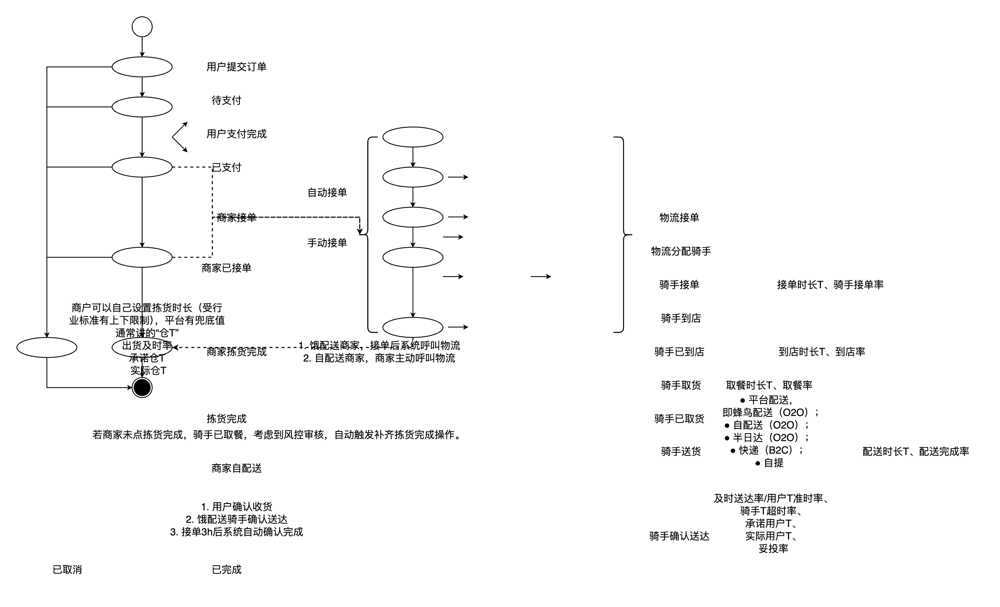

### 1.3 履约中数仓的工作内容

沉淀履约体验指标，基于数据衡量履约做的好不好，明确后续履约做功方向。

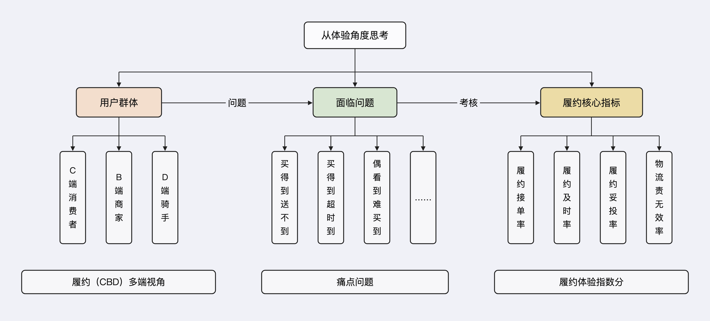

[履约业务过程中的核心指标](https://alidocs.dingtalk.com/i/nodes/XPwkYGxZV3RP0LZ7c9K4Y6jjWAgozOKL?utm_scene=team_space)

### 1.4 对履约域的一些思考

- **履约对本地生活来说是"产品本身"，而不只是成本项。**有了履约，我们才是lbs电商。传统电商把履约压缩进几天的快递时效里，用户对它的预期很低；但本地生活承诺的是 30~60 分钟送达，履约过程本身就是用户体验的核心部分。
- **零售与餐饮的履约有很大不同。**餐饮履约高度标准化：餐厅取餐、送到家、峰值清晰。但品类扩到医药、3C、鲜花、商超之后，履约需求开始分化——医药要 24 小时覆盖和紧急性，商超重物对装载有不同要求，高价值 3C 要签收和安全保障。
- **履约是一个"成本—效率—体验"的三角权衡。**只看时长会倒逼骑手冒险，只看成本会牺牲体验，只看体验则经济上不可持续。

# 2 工作内容总结

主要参与DIC**语义平台**以及**DataAgent**两个重点项目

## 2.1 语义平台零售履约域语义建模与生产

### 2.1.1 背景

数据平台领域正在经历一场范式转换。过去十年，行业的核心命题是"让数据可用"——搭建数仓、治理数据、构建 BI 体系；而如今，命题正逐步转向"让数据可理解、可操作"——不仅人要能用标准化的语言描述业务指标，AI Agent 也要能在统一的语义空间里理解业务、执行操作。

**为什么我们需要语义平台**

建设语义平台的核心收益在于**提效降本、统一口径、赋能AI**。

在数据分析中，业务方希望自由组合维度做自助分析，管理层要求所有报表对"GMV""履约率"这些核心指标口径的统一，而我们数据团队则需要在有限资源下保证查询性能。这三者之间长期存在矛盾，灵活性、一致性、性能与成本三者难以兼得。

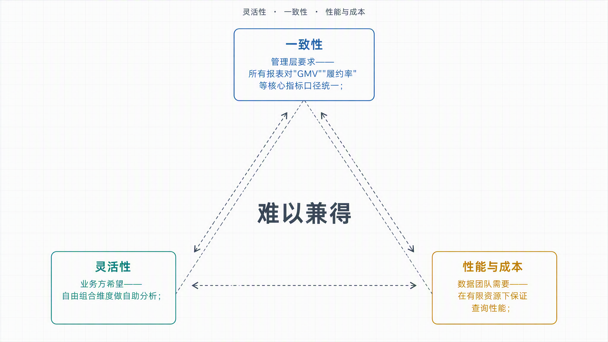

在BI时代，数据团队为平衡"灵活性、一致性、性能与成本"，通常采用一套高度依赖人力的研发范式："人工预计算"（即将业务逻辑固化在ETL脚本中，按需提前加工为物理宽表）。这种模式下，所产生的技术"负债"，也作为"必要的代价"长期存在，成为数据团队日常工作内容的一部分。

大应科技（Aloudata）白皮书指出，**未来判断一个数据平台是否合格，已经从"能否出报表"升级为"能否被 AI 理解"以及"能否跟上AI的思维速度"。我深表认同**

语义平台将硬编码的逻辑转化为可配置的语义资产（"指标人工ETL"转向"指标配置即可消费"的模式升级），实现指标"天"级的交付走向"小时/分钟级"（从"预制菜"到"预制原料"+灵活加工）。同时为大模型提供标准的业务语境和逻辑护栏，使 AI取数准确率提升至生产级（可低成本审计）；同时基于一套语义服务BI+AI场景，减少"数据对齐"的投入。

### 2.1.2 零售履约域语义的上翻与生产

数仓在整个语义项目中，主要负责语义生产和对接业务应用，依托于语义平台做生产和消费。

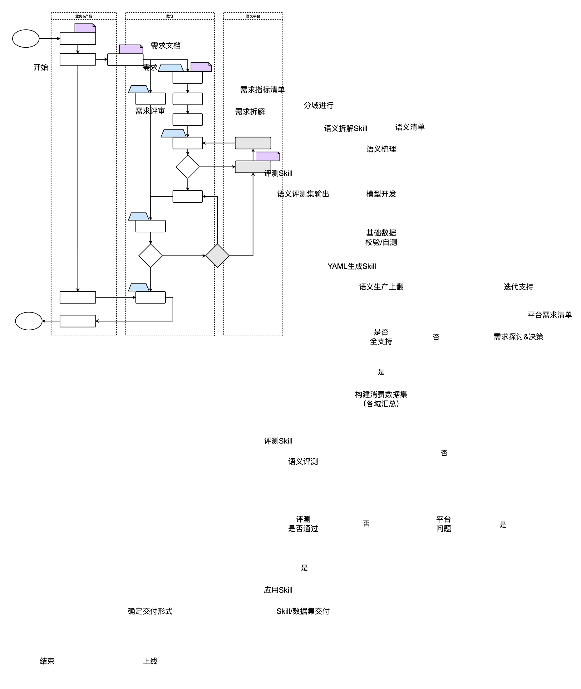

**主要完成的工作有**
- **梳理出履约域要上翻的****2张DW表****并入湖**
- **生成****4份YAML****文件，囊括两张核心表中的原子指标、维度**
- **累计上翻****109条指标****、****120条维度****，零售商家端履约域****覆盖率100%**
- **创建****2个****履约语义数据模型**
- **创建****3个语义评测集****，生成累计****389条DSL****评测，****成功率100%****，****通过率100%**
- **创建履约消费数据集**
- **部分履约域热点指标达到****1000+消费次数**

#### 履约域核心DW表梳理

由于在 **Paimon + StarRocks + 语义层 + AI** 架构中，星型模型是绝对的最优解，因此在语义模型的建设中，我们需要先梳理履约域DWD+DIM表的清单，这些表通用性强，常被下游消费/当前360或业务需求比较多的指标都基于这两张表加工

[llr_cdm.dwd_tcls_llr_ffl_ord_di](https://dw.alibaba-inc.com/dmc/odps-table/odps.llr_cdm.dwd_tcls_llr_ffl_ord_di/preview)

[llr_cdm.dws_tcls_llr_ffl_ord_1d](https://dw.alibaba-inc.com/dmc/odps-table/odps.llr_cdm.dws_tcls_llr_ffl_ord_1d/detail)

#### 语义生产

生产总结来说需要做：上翻维度 + 上翻指标 + 配数据模型(通过配置关联关系让维度和指标可组合)

**待上翻目标表入湖**

将履约域核心**两张事实表入湖**，保障语义消费效率
- **Paimon** 的 Upsert 能力和 Schema Evolution，低成本、高效率地维护标准的星型模型。
- **StarRocks**的联邦查询、物化视图、CBO 优化器和Colocate Join等机制保证快速查询

**生成YAML文件**

传统ETL模式下，新增一个指标意味着新增一条ETL任务链路。大宽表模式虽然可以复用已有字段，但跨主题的新增字段仍需回流ETL变更，开发周期以天为单位。

语义平台2.0采用**YAML声明式定义**，将指标生产从"工程任务"降级为"配置任务"。

| 差异项 | Before（传统ETL） | After（语义平台2.0） |
|---------|---------------------|--------------------------|
| 定义方式 | ETL脚本 + 元数据注册 + 维度管理系统，分散在3+系统 | 一份YAML文件，声明式定义全部语义 |
| 新增维度 | 回到ETL加字段→跑数据→注册维度 | YAML中加一段expression，分钟级生效 |
| 维度值域 | 人工维护映射表或文档，AI无法自动理解 | value_space直接写入YAML，AI自动映射 |
| AI可理解性 | 无，AI需自行猜测字段含义 | AI原生可读 |

利用工具skill：[metric-yaml-builder](https://open.aone.alibaba-inc.com/console/platform/dic-data/skill/metric-yaml-builder)先生成包含履约域核心表内原子指标和维度的yaml文件：

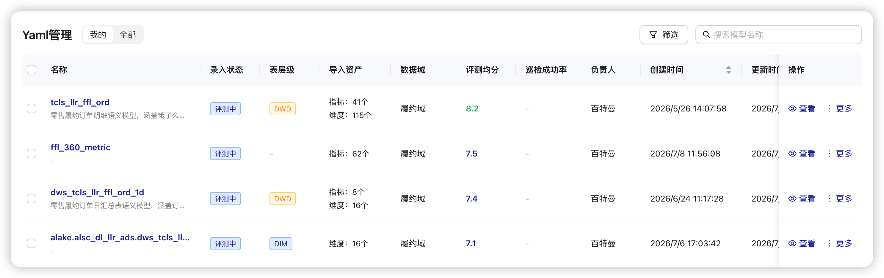

**人工review**生成的YAML文件：命名、is_fact、sla等信息是否正确且符合规范

包含了零售履约域最核心的**19条****原子指标**和**120条****维度**

**复杂指标上翻**

由于零售履约域的许多指标口径散落在不同的ODPS表、FBI报表中，且代码逻辑复杂，需要人工review并在语义平台上翻对应**派生指标、复合指标、自定义指标、派生维度**等。

经过筛查，这些复杂指标主要来自：
- [llr_ads.ads_tcls_llr_eb_shop_service_his_nd](https://dw.alibaba-inc.com/dmc/odps-table/odps.llr_ads.ads_tcls_llr_eb_shop_service_his_nd/detail)零售商家端服务分析表
- [llr_ads.ads_tcls_llr_eb_shop_order_nd](https://dw.alibaba-inc.com/dmc/odps-table/odps.llr_ads.ads_tcls_llr_eb_shop_order_nd/)零售商家端-数据分析-营业分析表
- [tcls-履约-物流履约-履约质量-FY26-ODPS加速](https://fbi.alibaba-inc.com/fbi/new/page/1848720/edit.htm)履约质量FBI看板
- [tcls-履约-退单概况-FY26-ODPS加速](https://fbi.alibaba-inc.com/fbi/new/page/1848723/edit.htm)退单概况FBI看板
- [零售履约闭环_FY27](https://fbi.alibaba-inc.com/fbi/new/design/1907710/edit.htm)履约闭环情况FBI看板

将复杂、零碎的上翻流程抽象成**流程化**的工程，有了流程化的步骤再考虑如何实现**自动化**的上翻

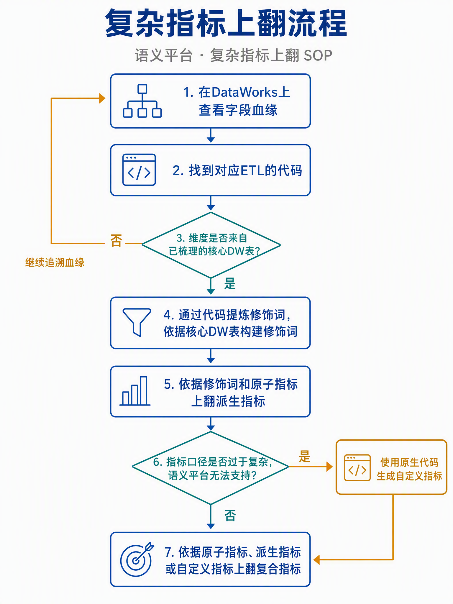

由于语义平台的建设还在初级阶段，在上翻过程中还是有很多问题[语义上翻问题记录](https://alidocs.dingtalk.com/api/doc/transit?dentryUuid=m9bN7RYPWdlGnPMruK4Krp15WZd1wyK0&queryString=utm_medium%3Ddingdoc_doc_plugin_card%26utm_source%3Ddingdoc_doc)，是在上翻过程中通过与平台侧同学、数据资产owner沟通解决的，生产侧与平台侧共同协作，推进语义项目的建设

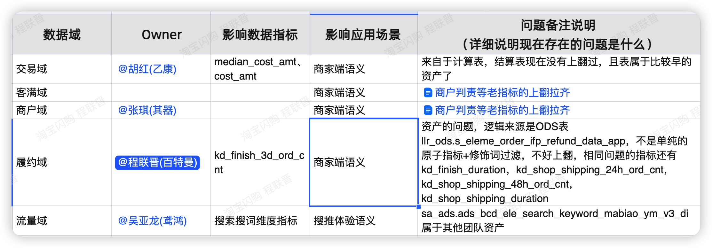

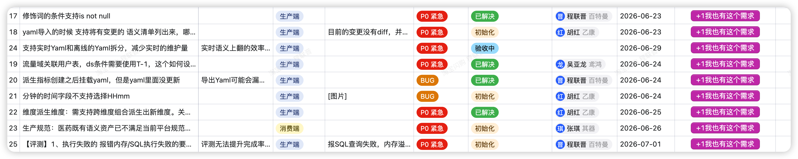

同时沉淀出一些语义上翻过程中的注意事项，帮助大家绕过常见坑

[6.零售语义生产&消费&排错QA](https://alidocs.dingtalk.com/api/doc/transit?dentryUuid=N7dx2rn0JbZQDaYOsZl0EwYeJMGjLRb3&queryString=utm_medium%3Ddingdoc_doc_plugin_card%26utm_source%3Ddingdoc_doc)

**配置数据模型**

事实表YAML文件上传后，配置数据模型，定义事实表-维表的关联关系，作为语义消费时指标可下钻维度的元数据来源

配置**2个**履约域语义数据模型，涵盖零售语义消费多种场景

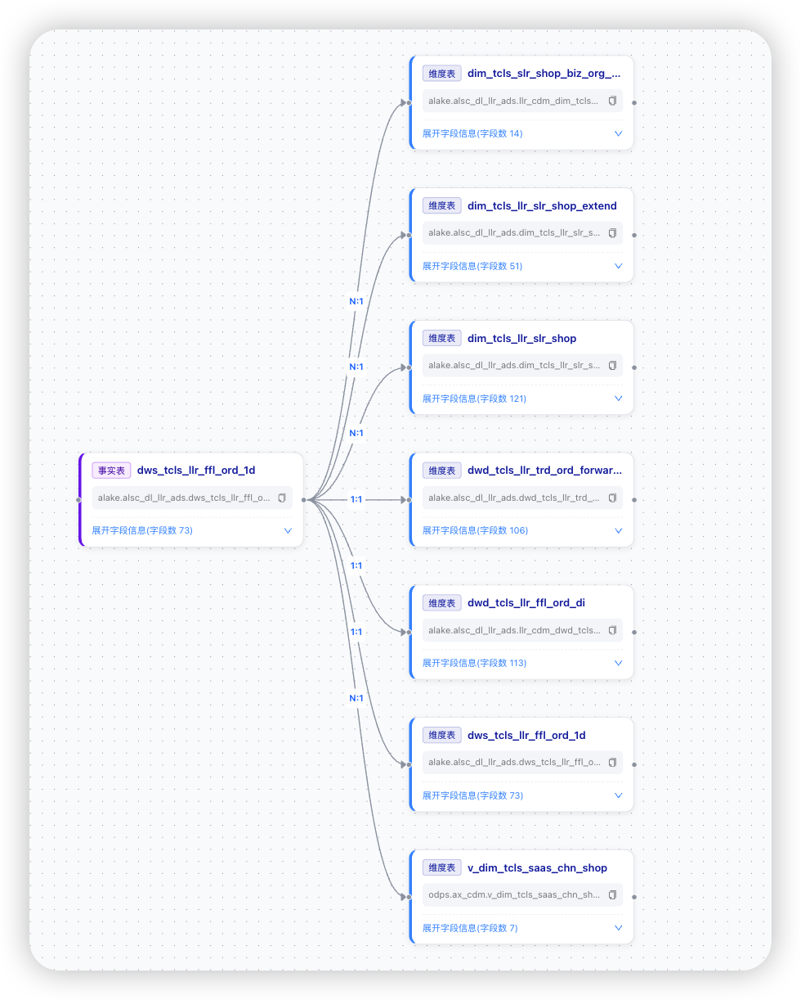
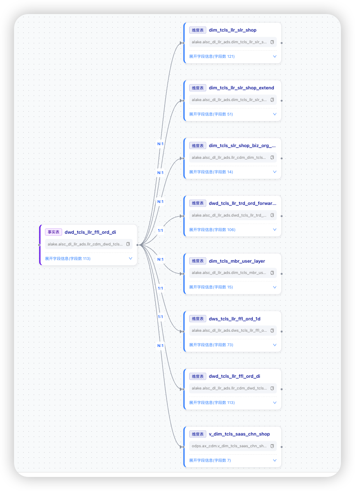

#### 语义DSL评测

在上翻的语义消费前，要对已经上翻的语义进行DSL评测。因为在语义生产中DSL评测扮演着"**质量闸门**"的角色，本质上是把质量问题拦截在离数据消费最近、离业务影响最远的位置。

创建了**三个评测任务**

| **评测集名称** | **DSL数量** | **查询成功率** | **通过率** |
|-------------------|-------------|-------------------|-------------|
| 360核心看板履约域指标评测 | **239** | **100%** | **100%** |
| 零售履约域指标评测 | **60** | **100%** | **100%** |
| 零售履约域单量指标评测 | **90** | **100%** | **100%** |

### 2.1.3 个人思考

[对语义工作，对AI数据工程师的思考](https://alidocs.dingtalk.com/api/doc/transit?dentryUuid=ZgpG2NdyVXrAPQ3miPxM2ann8MwvDqPk&queryString=utm_medium%3Ddingdoc_doc_plugin_card%26utm_source%3Ddingdoc_doc)

- Data for AI时代**，语义层是大数据通往大模型的关键桥梁**
    - 让 LLM 直接面对物理数据库生成 SQL 是一种高风险的架构
    - 物理表晦涩的字段名和复杂的 Schema 并不是 AI 友好的知识库
- **对AI数据工程师的理解**
    - 语义资产的上翻，看似"搬砖"**，**实际上需要对业务逻辑有深入理解
    - 未来数据团队的角色转型：从写ETL的"**管道工人**"转型为"**资产管家**"
    - 未来所谓的纯血ETL会越来越少了，结合AI的数据生产消费会越来越多

## 2.2 零售DataAgent相关开发

### 2.2.1 背景
- **战略层面**：各团队都在推进 AI Native 组织建设，核心探索是用 AI Coding 提升生产力；数据方向据此确立了语义平台、本体平台、DataAgent 三大核心技术锚点，目标是系统化整合底层能力，从"工具"转向具备泛化与推理能力的"知识引擎"
- **供需与竞争层面**：当前数据供给的现状是基础资产供大于求、但优质供给依然不足；AI 放大了需求的形式，却没有改变"优质分析能力稀缺"这一本质。竞品方面，FBI/ChatBI 等 BI 产品扩展性差、缺乏底层数据源支撑；而零售团队掌控底层数据资产、具备系统化解决方案能力。这个供需缺口和竞争窗口，正是把数据资产沉淀为 Skill 化优质供给的业务背景。

### 2.2.2 零售SubAgent skill设计与架构

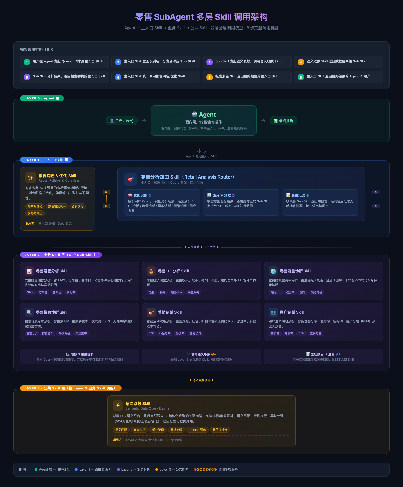

**整体skill编排时序图**

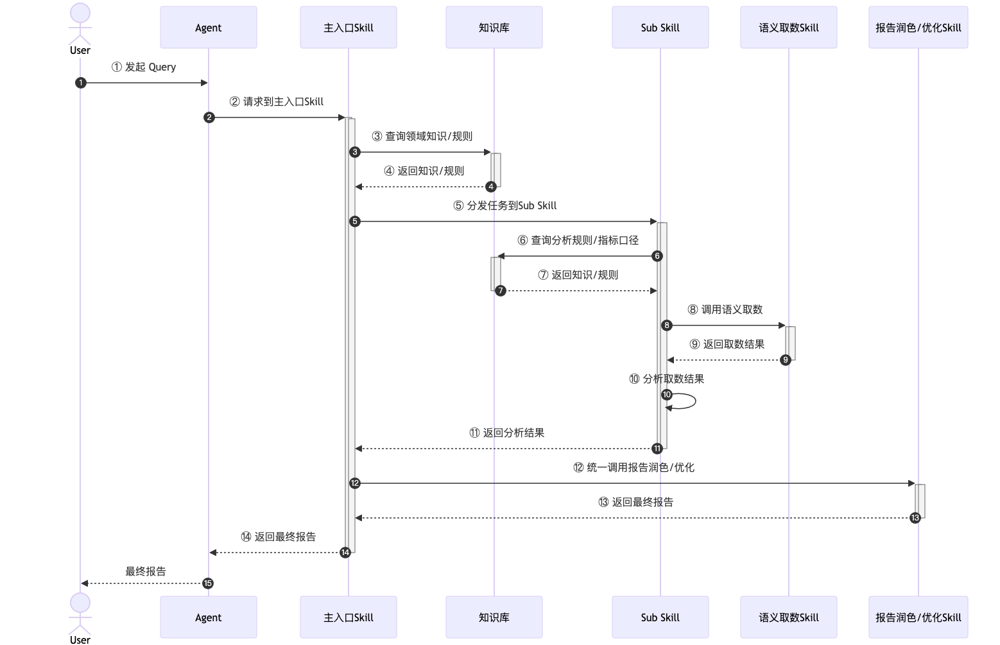

### 2.2.3 零售SubAgent公共语义取数skill开发

#### 为什么需要这样一个公共语义取数skill？
- **"查什么"和"怎么查"彻底分离**。 把业务问题翻译成结构化取数需求（哪些指标、哪些维度、什么筛选、什么时间范围）是业务知识，由业务 Skill 按自己的方法论决定，比交给通用匹配层更准；查询执行、并行分批、重试熔断是执行知识，沉到取数 Skill。这样模型自由推理只发生在业务分析环节，也就是该推理的地方，使得取数链路变成确定性的。
- **统一适配底层平台，契约稳定、实现可换**。 语义平台的协议、鉴权、接口等任何变化，只改取数 Skill 一处；各个业务 Skill 只依赖结构化契约，不感知平台细节。取数 Skill 是迭代频繁的一层，如果取数逻辑散写在多个子 Skill 里，每次优化要改多处，极易漏改和版本漂移，独立后升级一处，所有业务 Skill 无感知地跟着升级。将来新增新的业务skill，取数能力也是开箱即用。
- **业务 Skill 保持专注，指令体积可控**。 Skill 本质是给模型的指令文档，越长、主题越杂，模型越容易漏掉关键规则。业务 Skill 只写"分析什么、怎么拆解、怎么解读"，取数细节在调用取数 Skill 时才加载进上下文，两边都短而聚焦，执行质量直接受益。

事实上，语义平台提供了**原生的取数skill**：

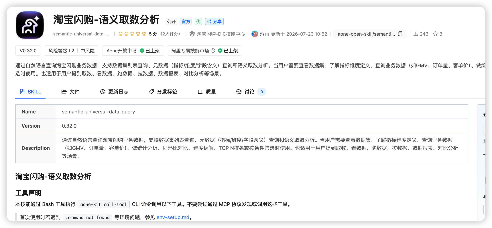

但是这个skill对我们的SubAgent项目而言有几个**痛点**：
- **确定性执行**：此skill是"理解层 + 执行层"的合体，适合人直接对话，它的交互确认环节（多候选选择、参数确认、收尾询问）对自动化是阻塞点
- **并行取数需求**：如果是数据分析场景，为了生成一份详尽完整的报告，往往需要多种指标、维度、时间范围的组合取数，此skill是单次串行的取数，没有任何并行编排能力，这样带来的时间成本对我们的用户来说是不可忍受的
- **异常感知**：对于工程化的项目，这个skill没有对失败的监控和告警

#### semantic-parallel-data-query Skill架构

[semantic-parallel-data-query-architecture.html](百特曼-实习转正答辩_images/semantic-parallel-data-query-architecture.html)

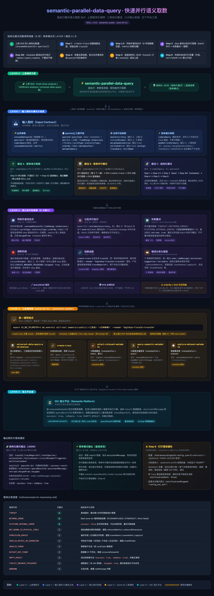

#### skill迭代过程

在本取数skill上线DataAgent后，目前已迭代**11个版本**

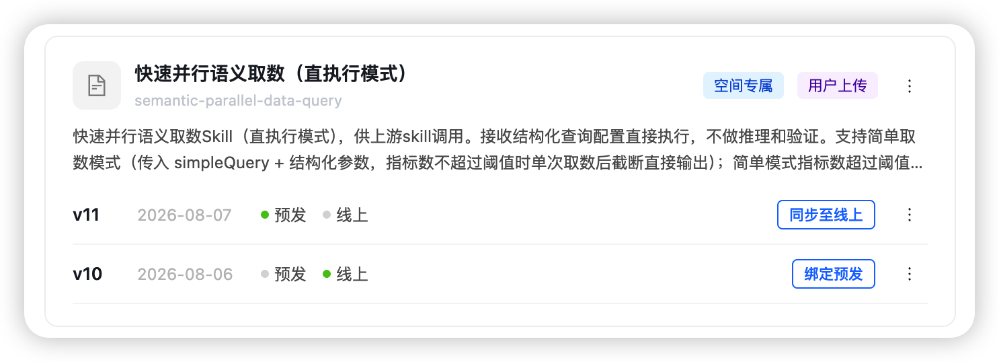

**迭代一**通过**砍去不必要的思考步骤、元数据验证、将参数构建规则内连到skill本体**的方式，将取数时间从2min量级缩短到50s量级，效率**提升100%**

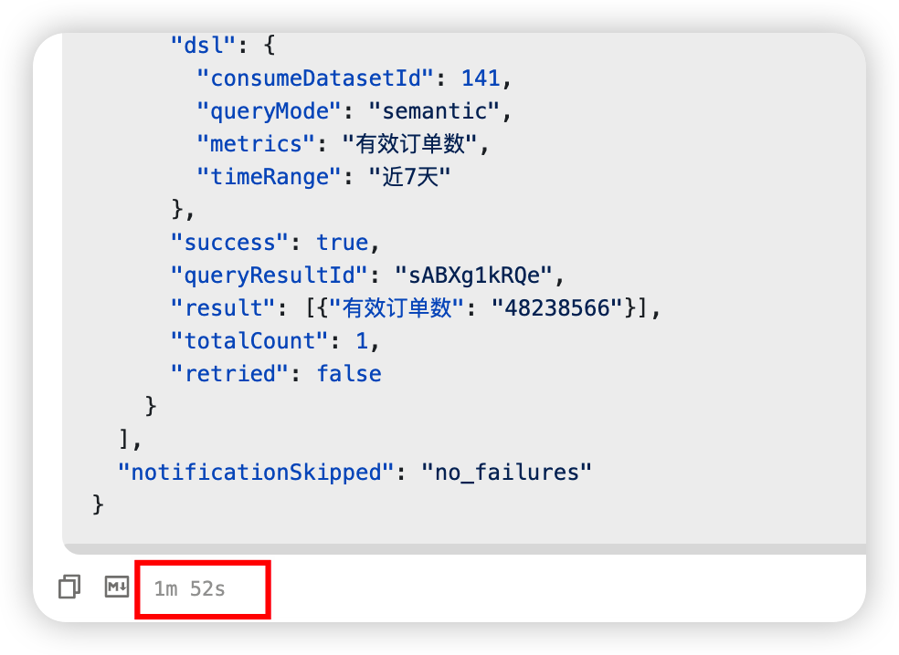
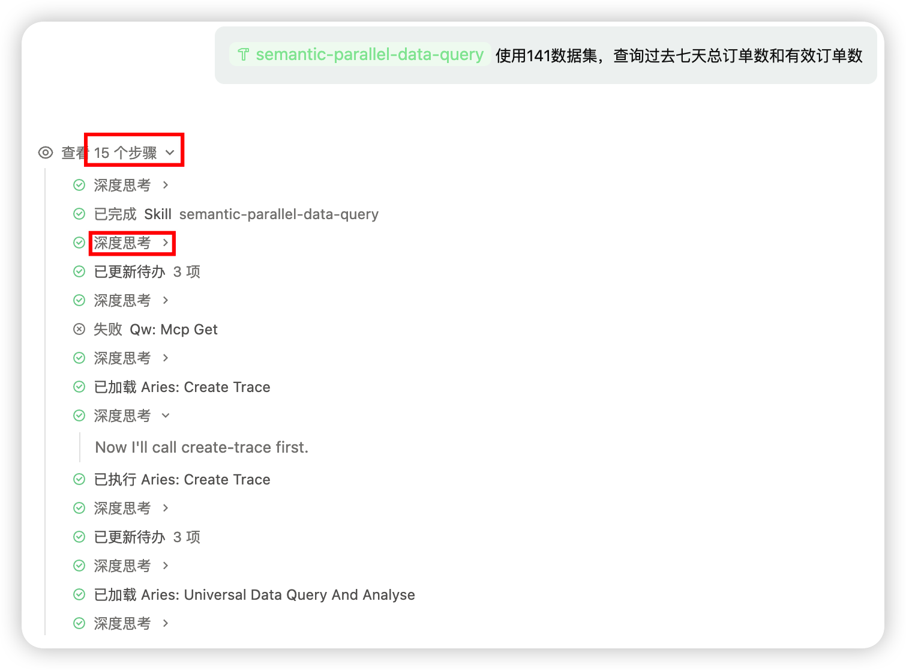
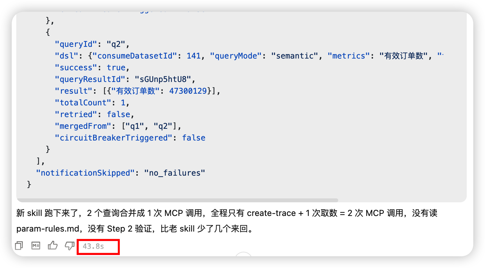

**迭代二**通过加入了**预处理**步骤：核心逻辑是按条件指纹（consumeDatasetId + timeRange + dimensions + filters + cycleType + statisticType + orderBy + limit）对 data 查询分组，同组内 metrics 用 ; 拼接成一条查询，减少 MCP 调用次数，使查询效率再次**提升100%**

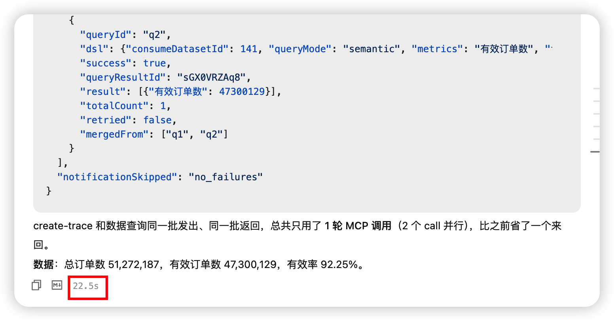

**迭代三**发现还有许多**简单取数**的需求：于是在skill中新增简单取数模式，定义了触发条件，**同时**在文件最顶部加一段"快速路径"，对skill文档做了一个截断，使得简单取数路径效率达到**5-10s量级**

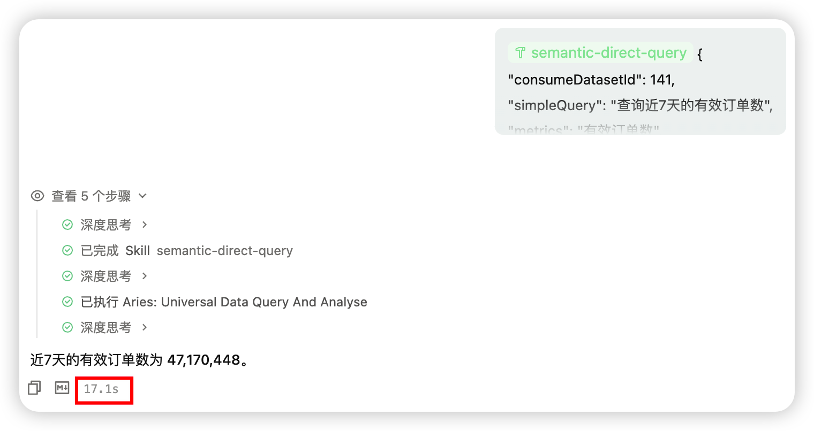
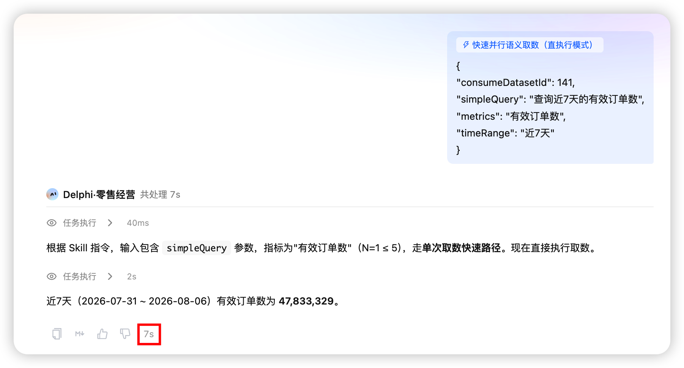

**迭代四**通过新增**简单并行模式**，解决许多用户query后，取数指标多，维度广，经过路由skill，没有路由到各个业务skill，而是直接取数时，路由到简单取数模式无法保证取数效率；

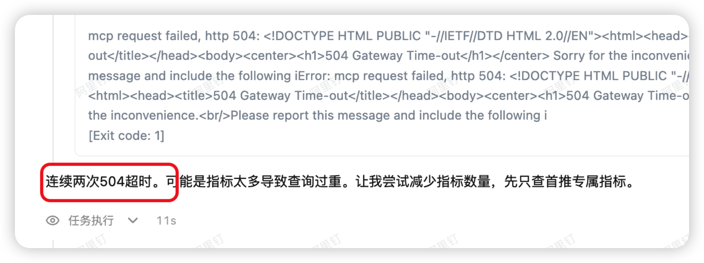

路由到结构化查询模式时，输出结构化输出不符合用户需求的问题

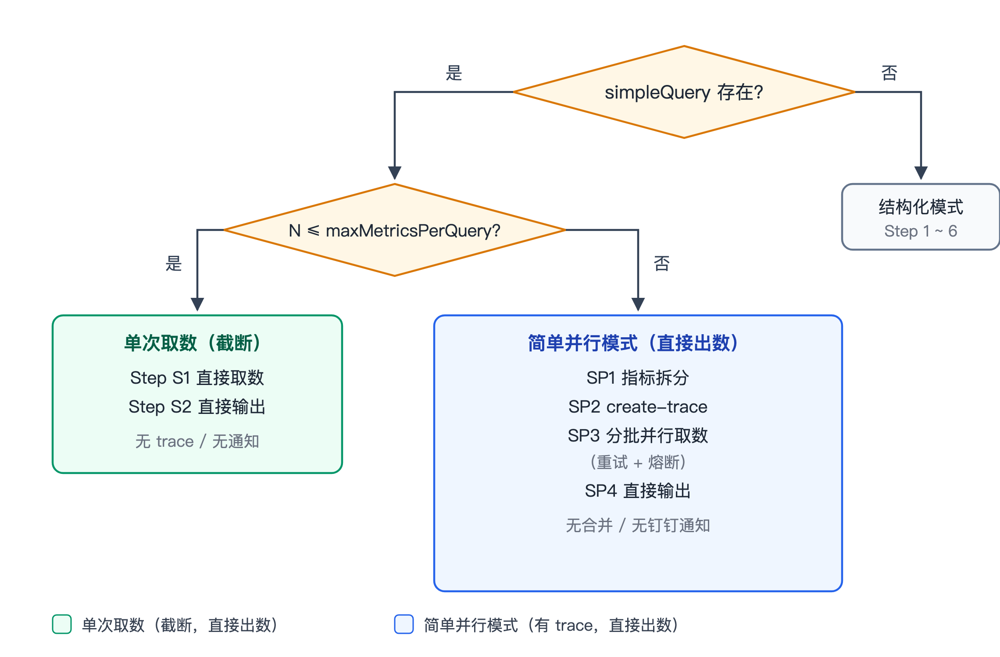

经过数次迭代后

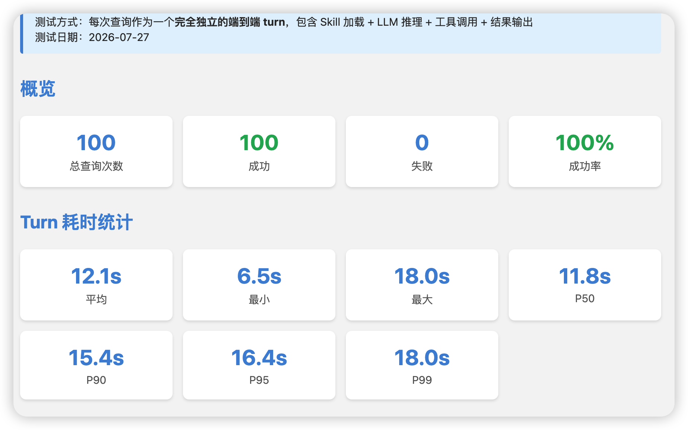
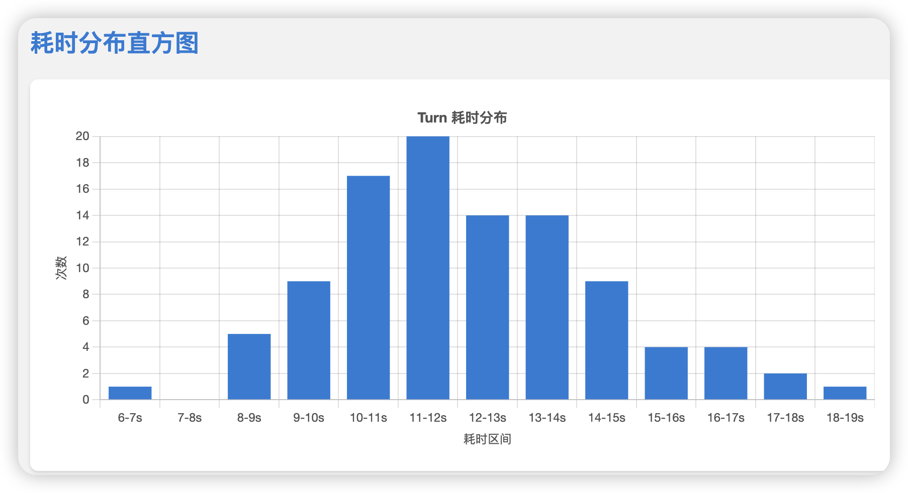

### 2.2.4 零售履约分析skill（开发中）

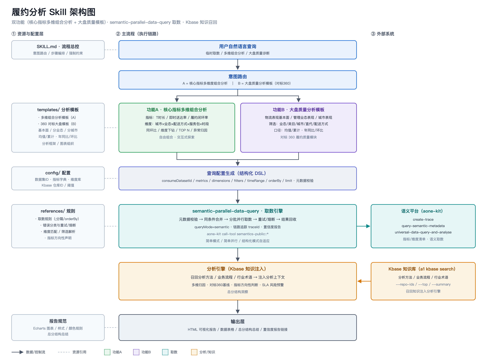

### 2.2.5 Skill评测

当前零售SubAgent项目，**11个业务skill全部依赖我的semantic-parallel-data-query取数**，因此本skill需要达到一个较高质量的评测

在**明镜平台**，首先创立了**30个**，**符合skill契约标准**的、覆盖**各种取数模式**、**多种取数复杂度**的query评测集，执行评测任务

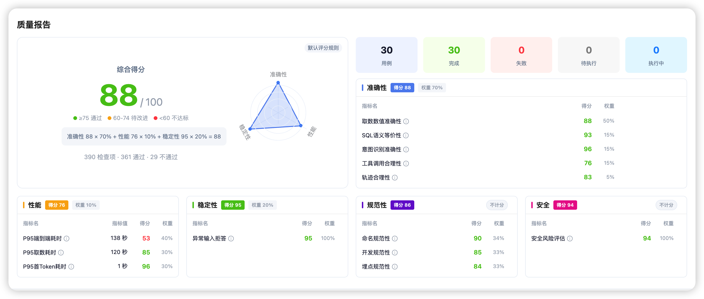

拿下**88分**，暂时位居本期零售SubAgent项目**第一名**

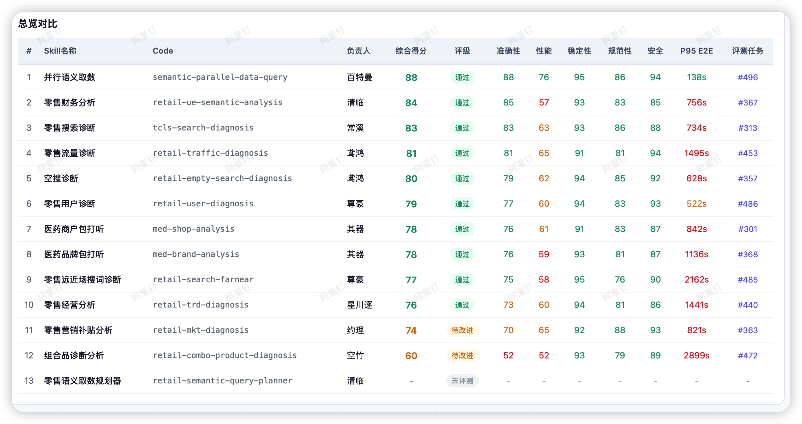

### 2.2.6 个人思考

**Skill 开发中的一些心得**

1. **"不做"比"做"更难设计**

这个 skill 一个很大的特点不是它做了什么，而是它明确不做什么——不推理、不校验、不做业务判断。但要让一个 AI agent "忍住不做"其实很难，因为 agent 的天性是"尽力帮忙"。在我的skill中，解决方式是在契约层中**用结构化输入代替自然语言理解**、**明确边界**和**负向约束**

2. **给 Agent 写文档和给人写文档不一样**

给人类写文档追求全面、易懂；给 agent 写文档追求精确、无歧义、可执行。
- 多给几个完整的输入输出示例（few-shot），模型会强烈模仿示例的格式和详略程度。
- Agent 处理长文档时容易遗漏细节，关键规则必须在多处锚定。

**对当前DataAgent的一些思考**

1. **当前 Data Agent 的瓶颈不在模型，而在可靠性工程**

单步能力（写 SQL、选指标、读元数据）模型已经做得不错，但 agent 是多步编排的，每一步 95% 的准确率连起来五步就只剩 77%。所以 demo 惊艳和产品可用之间的鸿沟，本质是错误在链路上的复合。我们的精力应该多花在压缩这条链路的出错面上，而不是关注模型。

2. **实践上跑得通的形态是"结构化自治"，而不是完全自治**

完全放手的 agent 会漂移，完全写死的又不叫 agent。成熟的方案应该是固定骨架加灵活填充：输入契约、执行分支、熔断降级、输出契约这些是硬的，中间的问题理解交给模型。

3. **loop**
- **评测驱动**。把评测变成回归用例，每修一个 badcase，就把它固化成一条精选评测用例（原始问法 + 期望的指标/维度/数值），评测集像滚雪球一样增长
- **知识驱动。**根据评测的结果，不停地对知识库做一些迭代，补全Agent的能力死角

## 2.3 日常需求

### 2.3.1 速客服务包计入自配

**背景**

物流新上了个服务包叫"速客"**，**速客服务包没有计入平台配，而计入了自配。有品牌签约速客后，发现**指标大幅下滑**了，发现了这个异常，这个问题是全零售层面的，所有业态的数都不太对头。

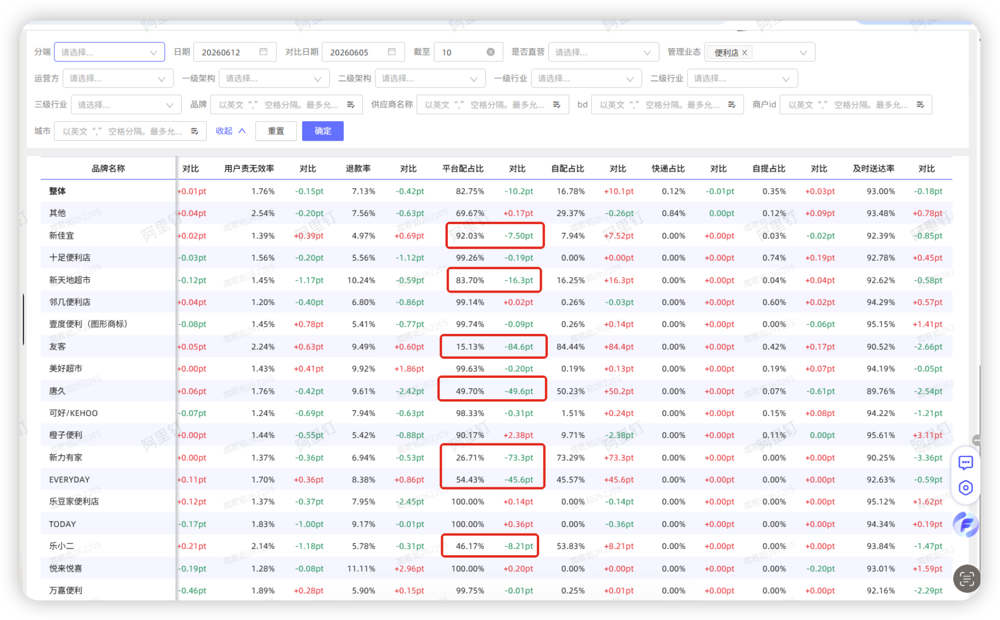

**开发过程**
- **数据探查**，写sql探查数据情况，数据占比
- **字段变更**，找到口径中受影响部分，将对应服务包加入平台配送
- **数据核验**，数据回刷后发现可在"平台配送"中找到对应服务包

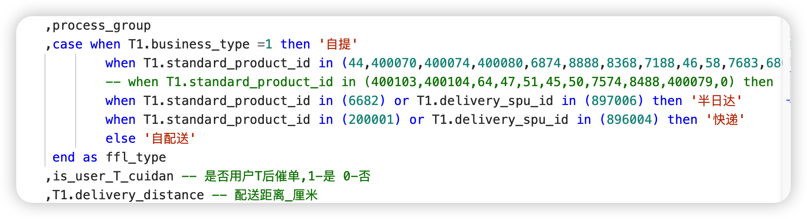

[20260708速客服务包计入自配](https://alidocs.dingtalk.com/api/doc/transit?dentryUuid=dQPGYqjpJYgLPRrnhBrRp35qWakx1Z5N&queryString=utm_medium%3Ddingdoc_doc_plugin_card%26utm_source%3Ddingdoc_doc)

### 2.3.2 实时逆向单商品开发入湖

**背景**

因为生鲜商品的品质问题存在**突发性、实时性**，需要by商家by品类制定品质问题单考核阈值，针对发现了严重问题单的商品进行实时下架、库存置零等治理动作。需要在alake.alsc_dl_cdm.dws_tcls_llr_rfd_ord_ri底表里加入实时数据字段：item_name(非必须） , item_ID,cate_level2_id ，cate_level2_name,cate_level3_id,cate_level3_name；用来做实时商品治理。

**开发过程**

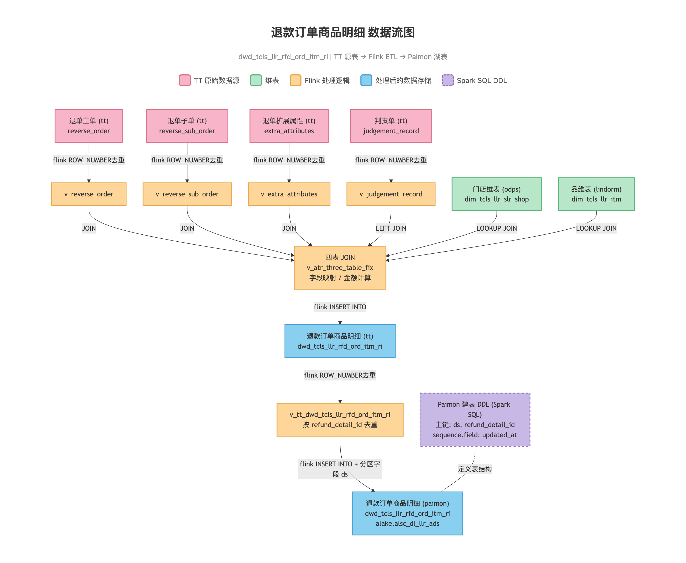

[20260604需求记录](https://alidocs.dingtalk.com/api/doc/transit?dentryUuid=YMyQA2dXW7921oeYC5npAyZnJzlwrZgb&queryString=utm_medium%3Ddingdoc_doc_plugin_card%26utm_source%3Ddingdoc_doc)
[20260609debug记录](https://alidocs.dingtalk.com/api/doc/transit?dentryUuid=G1DKw2zgV2R0zvPncP4qQAOwVB5r9YAn&queryString=utm_medium%3Ddingdoc_doc_plugin_card%26utm_source%3Ddingdoc_doc)

# 3 收获与感悟

## 3.1 对淘宝闪购文化的感知

- **阳光**
    - 有能量：积极行动，相信路虽远行则将至，事虽难做则必成
    - 够真诚：怀揣善意，真诚待人，愿意直接表达和帮助他人
    - 不抱怨：认真但不为个人得失较真儿，我们都是时代的受益者
- **务实**
    - 解 bug：从小事做起，从当下能做的事做起，踏踏实实解决每个问题
    - 拿结果：由近及远，高效执行，先拿能拿到的结果，积小胜为大胜
    - 接受不完美：不追求完美条件下的作业，善于不足条件下做到最优
- **自驱**
    - 有洁癖：对工作交付高标准、严要求，追求有质量的过程和结果
    - 不设限：勇于跨出舒适圈，也敢于挑战更高目标，不断自我突破
    - 团队成功：少提你/你们，多提我/我们，主动补位，帮助团队成功
- **坚持**
    - 看本质：聚焦客户价值，回归业务本质，坚持做正确的事
    - 有定力：坚定目标和方向，保持专注，打穿打透
    - 持之以恒：不轻易放弃，对当下有耐心，对未来有信心

## 3.2 收获与不足

**收获**

1. **参与团队的AI项目，成为Data for AI转型的一份子**
- 参与零售SubAgent架构的讨论与设计
- 参与体会语义平台资产的建设，亲手搭起数据与AI之间的桥梁
- 为整个项目开发公共Skill，学习到相关方法论以及优化迭代的流程

2. **软实力有所增长**
- 团队协作能力
- 独立思考能力
- 持续学习

**不足**

1. **技术深度有待加强**,目前能完成日常开发任务，但对底层原理（如计算引擎的执行机制、性能调优、数据建模方法论）的理解还比较浅，遇到复杂问题时分析手段有限。
2. **业务细节理解仍不到位**,对所在业务域的全链路流程和核心指标的理解还停留在任务层面，更多是"接到需求就做"，对指标背后的业务含义、上下游影响缺乏系统性认识，后续需要主动补齐业务背景知识。

## 3.3 展望

**提升技能的同时多加思考，期待未来在淘宝闪购继续成长！**
- **补齐履约域实时短板：**当前零售履约域中，重要指标的实时覆盖率不足。希望未来可以在继续学习熟练开发技术的过程中补齐这一短板
- **继续提升业务理解：**深入思考需求/项目背景，发掘需求的深层目的。多思考这个数据给谁看、用来做什么决策，多与业务、运营同学交流，多看团队沉淀的业务文档，形成自己的总结
- **继续探索AI与数据的结合：**关注AI行业最新动态**，**继续关注 DataAgent、语义建设等的行业动向，多调研如今的AI数据产品形态，探索Data for AI的治理问题等
