# 零售专项汇报

## 一、项目背景与定位（Why）
- **行业趋势 / 市场机会：**经历去年的闪购战役，淘宝闪购与BD快速补齐供给份额，拉齐订单规模，使得我们同等规模下展开更加精细化的经营效率的竞争；今年淘宝闪购在份额相对稳定的前提下，通过提升GMV规模，提升笔单价来进一步提升经营效率，减少单均UE的差距；
- **战略价值：**零售相对于餐饮不仅在经营效率上需对齐主站目标，且在即时零售的大战略下也承接了集团的关键业务增长目标，具体体现在零售整体搜索UV的增长、远近场的融合、即时零售1P供给的持续提升等项目上；零售数据团队作为零售业务BP职责也因此承接了**零售搜索增长**，**零售商品治理与品运营** 两个关键项目；

## 二、业务目标拆解（What）

### 核心业务目标和拆解逻辑
- 闪购搜索零售净 G 占到家搜索大盘 30%
- 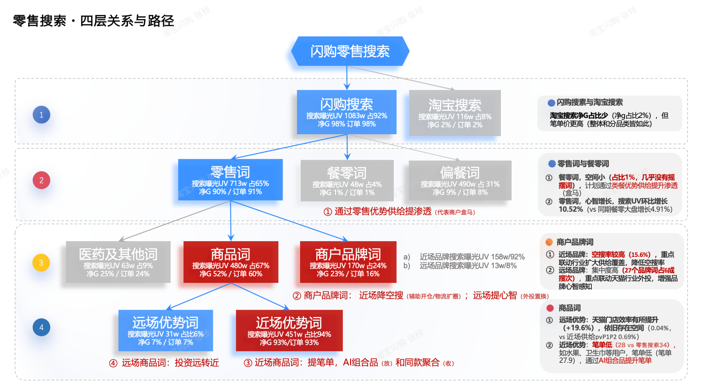
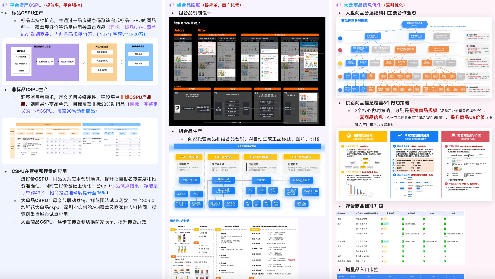

### 关键业务场景和预期收益
- 场景1：餐饮词下的零售供给渗透
    - 谁：搜"泡面/牛奶/水/纸巾"等即食即用词的跨品类溢出用户——需求本质是零售商品，但被搜索场归为餐饮意图
    - 问题：召回池被餐饮商户挤占，用户看不到即视为无供给流失；本质是餐饮/零售意图边界模糊 + 召回优先级错配
    - 预期收益：700w（+40%），Baseline：500w 净G
- 场景2：搜索笔单价结构升级
    - 谁：闪购搜索所有成交用户，重点在低单价成交池（历史笔单价 < 中位数的存量用户）
    - 问题：涨价空间封死（价敏用户不接受涨价），只能靠结构升级——用大单品/组合品/囤货装挤掉低单价品坑位；核心矛盾是"曝光坑位有限 × 客单价拉升与消费降级并存"（组合品既可能拉升也可能稀释单价）
    - 预期收益：39 元（+18.2%），Baseline：35 元/单
- 场景3：商户品牌词空搜救回
    - 谁：搜商户品牌词/门店名的高意向用户（搜索意图强度 Top20%），LBS 命中门店但无库存/未上架/关店
    - 问题：搜了没结果直接跳出转化损失最大；空搜命中三类根因——门店离线（LBS 半径外）/ 商户下线（关店/停业）/ 商户未开通（未接入搜索池）；需要根因分诊 → 差异化救回（非空搜率一刀切）
    - 预期收益：13%（-3pt），Baseline：空搜率 16%
- 场景4：远场优势词挖掘
    - 谁：搜"某品牌零食/家电/母婴"等天猫供给强 × 闪购供给弱词的用户
    - 问题：闪购本地供给数量少/价格贵，天猫远场供给多但入口不打通；核心是"搜索意图存在 × 本地承接能力不足"的错配，损失并非用户流失而是GMV 溢出到淘宝主搜（可测量）
    - 预期收益：10%（+4pt），Baseline：远场优势词天猫净G占比6%

## 三、技术目标推导（How - 目标层）

| **业务目标** | **技术目标** | **衡量指标** |
|---|---|---|
| ET零售词搜索UV 达 834w（从729w） 笔单至 39 元（从35元） 组合品专项 • 单店组合品订单净G渗透率≥ 10% • 单店组合品订单笔单价≥ 1.15 商品基建 • 爆好价CSPU对TOP40%净G的标品类目，净G覆盖度达到90% | 1. 组合品  1. 提升CSPU/店内组合品规模挖掘充分性  2. 提升选商选品精准度 2. 商品基建  1. 提升标品/非标库 CSPU规模  2. 提升同品归一覆盖率 3. 构建组合品效果与机会诊断能力 | 1. 资产规模（CSPU组合数、覆盖门店数、覆盖商品数） 2. 曝光率、动销率 3. CSPU近90天净G覆盖>=90% 4. 诊断决策采纳后净G>10% |
| 餐零词净 G 达 700w（从500w） | 形成词盘收敛能力，标定query缺口类型/空间大小/供给可达性/分层动作四类标签，T+14 回测持续自更新的诊断决策引擎，回测结果反哺词盘置信度权重 | 做功词覆盖量 ≥ N 个，有效正向占比 ≥ 70% 约束：餐零词整体订单损失 <0.3%，净G不损 |
| 商户品牌词空搜率下降 3pt（16%->13%） | 构建商户品牌词空搜三维归因诊断与策略生产能力，沿"供给缺口/有供给未召回/用户意图模糊"分类归因，搭建数据诊断→归因分类→可作业清单端到端 pipeline | 商户品牌词识别占比 作业采纳率 |
| 远场优势词净G占比从6%->10% | 构建远近场优势词四象限（本地承接强弱 × 远场优势强弱）诊断能力，识别"高意图 × 低本地承接"象限词，输出分层动作候选清单交付搜推承接 | 远场优势词覆盖>=xx 远近场词需求满足度>=x% |

## 四、技术能力建设（How - 能力层）

### 4.1 能力全景图（核心原则：**从业务出发，用技术落地，靠飞轮持续**）

[tech-blueprint.html](https://cdfc69-sandbox-sessiona931178aba7845edab-8080.agent.alibaba-inc.com/tech-blueprint.html)

### 4.2 核心能力

#### 能力：搜索诊断与策略生产
- 解决什么问题：搜索诊断有四大典型子场景——餐零词供给缺口、图文筛承接、商户品牌词空搜、远近场优势词，各自独立建设导致词盘/口径/分层/回测重复造轮子；同一搜词还常同时命中多场景（如"泡面"既是餐零词也是远近场词），缺统一入口做交叉裁决、也难沉淀跨场景策略知识库
- 核心设计思路：整体是"统一词盘底座 → 多场景诊断插件 → 分层策略输出 → T+14 效果回测"四段式引擎，把四类子场景收敛为一套可复用骨架
    - 词盘底座：所有子场景共用一份搜词大盘（意图分类、类目可达性、供给水位、四象限位置、空搜归因等语义标签），一次清洗多场景复用
    - 诊断插件：供给缺口/图文筛承接/空搜三维归因/远近场四象限四类诊断可插拔挂载，共用异动检测、P75 测空间、DID 回测三大公共算子
    - 分层策略：按归因结论自动路由到对应子能力，各自沉淀垂直方法但共享"测空间+多维归因+规则语义分层"范式，各产出可作业清单
    - 回测闭环：T+14 回测把策略兑现率反哺词盘置信度，采纳与效果沉淀进知识库
- 技术亮点：双层 z-score（判断点+判占比）把大盘涨跌拆成噪声/缺口/异动，避免把缺失回刷当真跌；搜词分类树按 share/TopN 逐层下钻自动路由；P75 测空间、多维归因、规则+语义改写、DID 回测做成共享工具箱，同一搜词跨场景对齐四标签口径
- 复用性 / 可扩展性：新增子场景（价格带/时段/新老客诊断）只需实现插件接口即可接入统一底座；四标签输出与下游运营/搜推动作解耦，便于跨场景知识库沉淀

#### 能力：商品基建与治理
- 解决什么问题：不同商家的同款商品被拆成独立 item，导致共购挖掘、价格对比、推荐打散等失去基础。CSPU 覆盖是品运营一切下游能力（组合品挖掘、趋势品推荐、竞品比价）的地基。
- 核心设计思路：标品通过多模态同品归一推理实现商品挂载、通过类目 CSPU 属性洞察 + 算法挖掘 CPV 实现 CSPU 挂载。
- 技术亮点：
    - 验证集生命周期管理 — 同品归一算法的训练集/验证集实行严格的生命周期管理：新版本上线前必须在验证集上验证通过，迭代过程中持续监控 precision / recall 漂移，验证集定期更新以覆盖新出现的商品模式，确保算法质量不因数据分布变化而退化。
    - 双飞轮正向增强 — 标品通过"标品库 ⇄ 商家库"双向流动持续提升覆盖率，非标通过"CSPU 库建设 → 发品标准 → 属性治理 → 自动挂载"四阶段正向增强，两个飞轮各自依赖对应的数据能力（同品归一 / 关键属性洞察），形成质量-覆盖的正循环。

#### 能力：品运营效果诊断
- 解决什么问题：对应 KR3 商品运营（组合品 / 爆好价 / CSPU 聚合）三个子专项在搜索场景落地的过程中，业务缺乏对用户体验、流量分配等 C 端效果的系统性诊断手段和策略备选解法知识沉淀。核心矛盾是品运营动作嵌在自然趋势 / 季节 / 补贴 / 算法波动的多因素混杂环境里，需要针对特定品集合，从成交结果出发快速定位异常、识别增长机会，并把诊断能力沉淀为业务侧可自助交互探索的工具
- 核心设计思路：整体架构是一套"特定品集合锁定 → 核心指标异动检测 → 多维下钻归因 → 策略备选生成 → 交互式产品化沉淀"四段式效果诊断引擎，把"每个专项各写一套报表"沉淀为业务可自助使用的跨专项共用 Skill
    - 异动检测视角：历史趋势 + 实验对照双视角互补，同时发现"下跌异常"与"未达潜力"两类信号
    - 多维下钻：用户分层（新老客 / 消费力 / 决策链路）× 品类结构（类目 / 价格档 / 组合形态）× 访问动线（曝光→点击→加购→成交漏斗断点）× 时空维（城市线 / 门店档 / 时段）四维立方体，定位效果集中点与摊薄点
    - 策略输出三层颗粒度：战略信号灯（GREEN/YELLOW/RED 定位问题）→ 命题级决策建议（短期个案处方 + 长期数据驱动动作）→ 备选解法矩阵
- 技术亮点：趋势、实验结合，漏斗切片和用户意图结合，分析逻辑可输出方便排查
- 复用性 / 可扩展性：可扩展到所有用户x商品的流量分发场景

#### 能力：组合品挖掘与建品

#### 能力：流量全景诊断
- 解决什么问题：当前各垂直诊断能力（供给缺口/品运营/空搜/组合品/推荐坑位等）各自独立运行，缺少一个从流量整体出发、逐层定位到具体场景的统一诊断。大盘指标异动时，无法自动判断异动来自哪个场景，也无法将归因结论自动衔接到对应的垂直诊断能力，导致人工串联成本高、诊断链路断裂
- 核心设计思路：整体架构是一个"零售大盘指标异动检测 → 场景归因及结构化拆解 → 垂直诊断衔接"的三层渐进式诊断引擎。L1 对核心指标做 z-score + 周同比双信号检测，自动过滤节假日/营销窗口噪声，仅当统计显著性与业务显著性同时满足时触发下钻；L2 按场景拆分后逐维度输出各分支增量贡献占比，自动定位贡献最大的异动分支与场景，每个场景有专属归因视角；L3 根据 L2 输出的场景归属与结构化拆解结论，自动路由到对应的垂直诊断能力
- 技术亮点：全景诊断将各场景纳入统一框架，消除各垂直能力的信息孤岛。L1 检测避免"统计显著但业务无感"的无效告警，L2 场景归因覆盖搜索、首推、频道、购后、店内等场景，结构化拆解支持供给类型、用户视角、管理业态、坑位等多维度下钻，L3 插件化路由将异动结论自动映射到对应垂直能力，形成"发现→定位→归因→行动"完整闭环
- 复用性 / 可扩展性：采用插件化设计，L3 路由规则引擎将异动类型映射到垂直能力，新增垂直诊断能力（如未来新增的搜索策略诊断、用户诊断等）只需注册路由规则即可接入，低成本扩展

## 五、技术实现路径（How - 执行层）

| **能力** | **技术方案与飞轮** | **关键技术细节** | **分阶段里程碑** |
|---|---|---|---|
| 搜索诊断 | 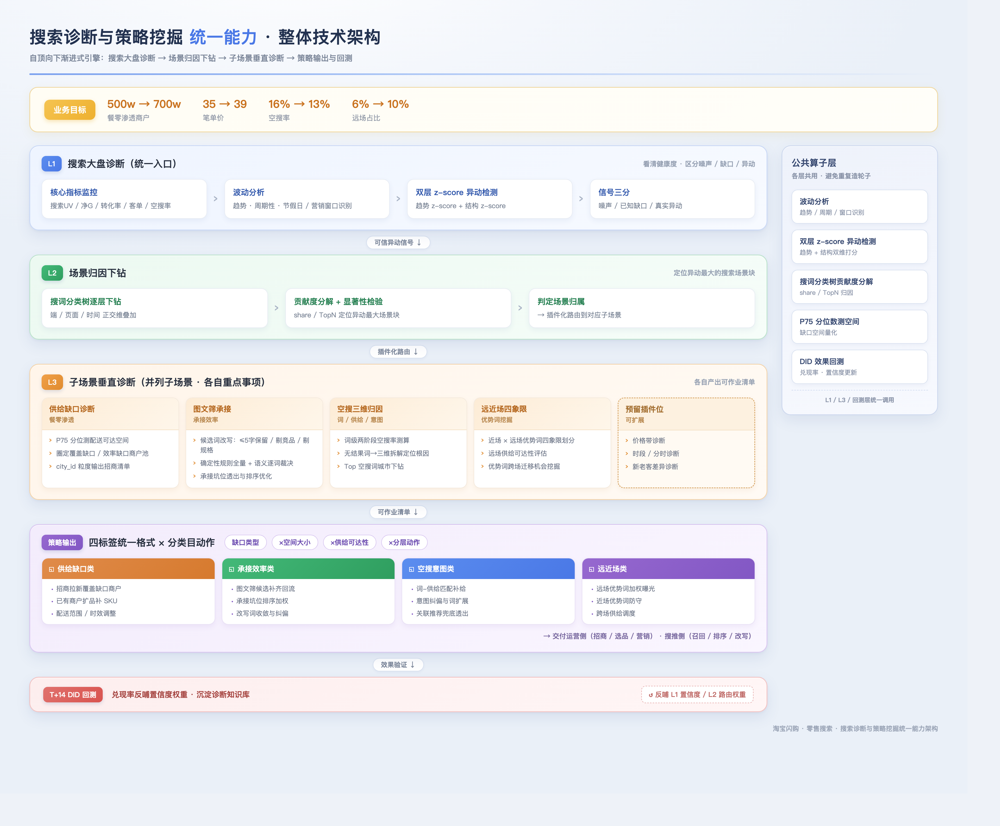 | L1 统一词盘底座 & 多场景标签化  挑战：四类子场景各自维护词盘，同一搜词标签口径冲突、更新频率不一，诊断结论时间口径都对不齐  方案：建一份统一搜词大盘（keyword×四象限位置×空搜归因）T+1 全量刷新，子场景只准拉取、禁止私建，标签冲突走优先级仲裁（战略权重>空间大小>供给可达性）——让四子场景共用一盘、跨场景交叉裁决、同一词口径统一，运营一次消费多场景标签 L2 插件化诊断路由 & 公共算子  挑战：四类场景各写一套异动检测/测空间/分层映射/回测代码，重复度高又口径不一，新增子场景成本高、下游难统一消费  方案：抽出四大公共算子（P75 测空间 / DID 回测 / 双层 z-score 异动 / 四标签体系）做共享库，子场景实现"诊断插件"接口即可挂载，输入统一为词盘 slice、输出统一为四标签清单并按业务目标自动路由——把新增子场景成本从"重写一套"降到"实现接口"，下游经统一入口拿到全部结论 L3 T+14 DID 回测 & 词盘自更新  挑战：策略清单交付后若无回测，诊断退化为"一次性作业"；词盘置信度不校准会持续把高误差词推给业务、损伤信任  方案：每批交付词做 T+14 DID 回测（词粒度实验组 vs 同意图 cluster 对照组），用"预测空间 vs 实际兑现"反哺置信度权重，连续 3 次兑现率<50% 的词自动降权/下架，策略采纳与拒绝理由沉淀进知识库——让诊断从"一次性输出"演进为"持续自更新的组织资产"，词盘每两周迭代、兑现率与运营信任度同步提升 |  |
| 商品基建与治理 | 标品 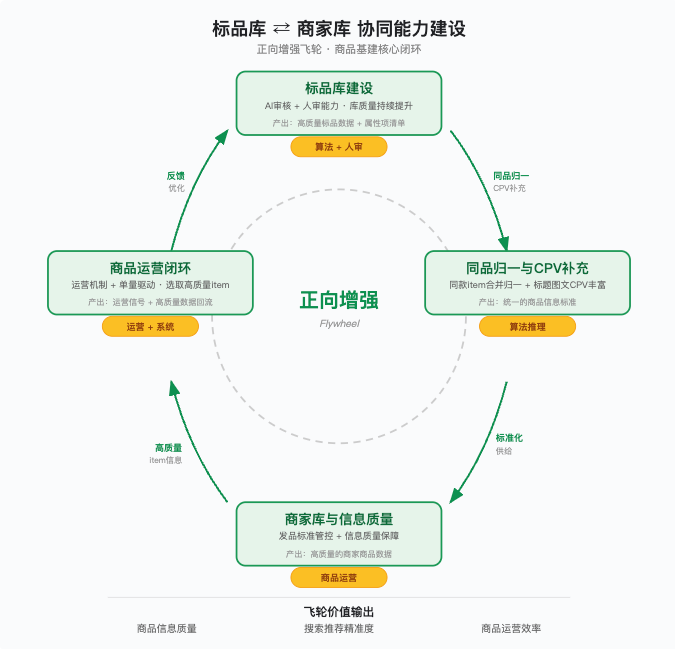 非标 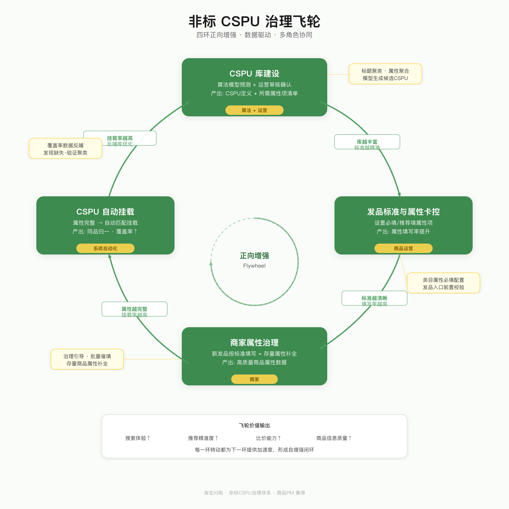 | 非标CSPU关键属性洞察：  **方案**：通过分析用户搜索需求、交易数据及商品价格分布特征，挖掘影响用户购买决策的关键属性项，作为 CSPU 构建的核心维度   **规则筛选（候选集生成）**：通过分析用户搜索需求、交易数据及商品价格分布特征，计算每个属性的多维度指标（搜索量、覆盖率、价格区分度等），通过多条规则触发筛选出所有满足条件的候选属性。此阶段产出的是"宽候选集"，可能包含语义相似的重复项。   **大模型推理（语义消歧 + 最优选择）**：将候选属性列表连同类目信息输入大模型，完成四项任务：①语义聚类 —— 识别含义相似的属性组（如"净含量"和"重量"和"单果重量"）；②冲突消解 —— 相似属性中按搜索量/覆盖率/价格区分度选取最优；③类目特性校验 —— 结合类目常识判断属性组合的合理性（如生鲜水果优先品种/产地/净含量）；④属性值标准化 —— 将不统一的高频枚举值归一（"3斤装" → "1500g"、"8cm" → "80mm"）。最终输出 Top 3-5 个关键属性 + 推荐理由 + 标准化枚举值 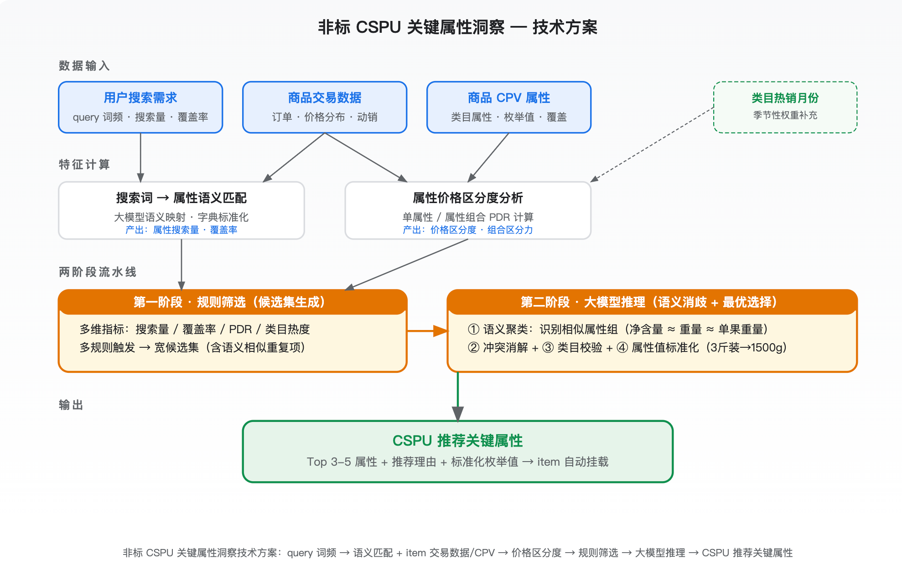  **效果**：已完成1897类目洞察（324非标+1124个日用百货+72运营近期重点运营），能力上架到图灵服务商品运营和行业运营。 标品库条码择优入库建设：  **挑战**：在有限的「算法资源」和「人力资源」约束下，如何从活跃商品400w条码中择优选择治理、并尽可能的选择优质商品图文等素材来补充条码信息以提质提效。  **方案**：按照订单&曝光贡献、核心业务提报（爆好价、品牌、淘便）高优先级条码推送治理入库。  **效果**：已推送21.6w、已生效14w条码 同品归一协同能力建设：  **挑战**：同品归一是搜推算法提效与B端商品治理的核心基础，搜推侧依赖其提升召回与排序效率，B端侧依托其优化商家图文资产推荐。提升模型准确率95%与召回率80%，降低人工成本，保持验证集活性  **方案**：   **优化同品归一整体协作流程** — 统一算法侧与业务侧的标注标准和工作流。   **训练集/验证集构建与管理** — 构建"检测 → 汰换 → 补充 → 版本化"闭环机制，确保评估始终反映模型在当前真实业务场景下的能力，为迭代提供可靠依据。   **困难样本挖掘** — 通过非同品 Top10 属性定位问题，利用向量相似度召回疑似同类样本，辅以人工 + 大模型验证机制筛选样本集合反哺算法。  **效果**：同品归一挂载商品2.68亿，标品类目归一净G占比70.20%（目标90%） |  |
| 品运营诊断 | 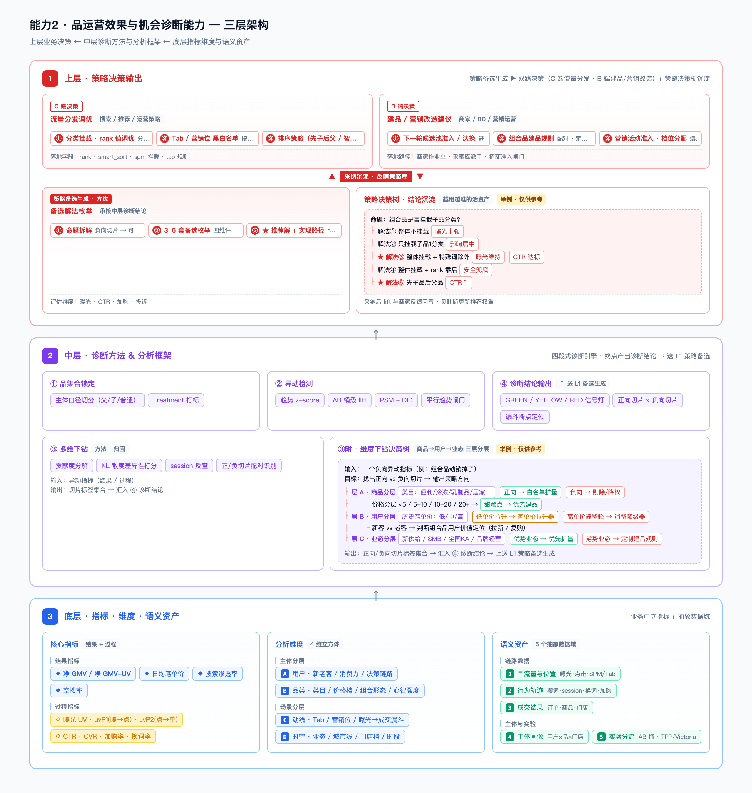 | 品运营效果与机会诊断  挑战：品运营的每个动作都嵌在趋势、季节、补贴、算法迭代等多因素混杂环境里，指标涨跌难归因，缺少系统化、可复用的诊断手段，机会和风险都容易漏。  方案：   四段式诊断引擎——品集合锁定（父品/子品/普通品切分+处理打标）→异动检测→多维下钻→诊断结论输出，标准化流水线   维度下钻决策树——商品→用户→业态三级分诊，配合贡献度分解与 KL 散度打分，定位漏斗断点、输出信号灯结论  效果：从"组合品单量负向"逐层下钻定位根因——非搭配货架混排点位吃掉 25% 曝光，但组合品 CTR 比子品低 10pt+，属典型效率洼地。推动下架混排后同店同品验证曝光 PV -40%、CTR +80%，去冗显著 策略备选生成与决策沉淀  挑战：诊断出问题后，业务真正要的是"该怎么做"。业务反馈多为模糊方向，难转成可执行策略；同类命题反复从零拍脑袋，缺可积累的解法资产  方案：   双路决策输出——C 端流量分发调优（挂载 rank/营销位黑白名单/排序）+ B 端建品营销改造建议（候选池汰换/建品规则/活动准入档位）   策略决策树沉淀——采纳解法与实际 lift 回写、贝叶斯更新权重，形成越用越准的活资产 |  |
| 组合品挖掘与建品 | 系统架构 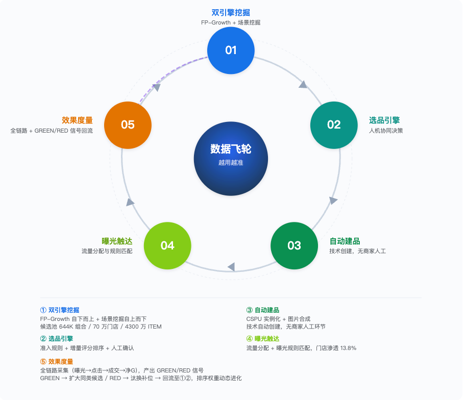 | 组合品多引擎挖掘  挑战：组合品挖掘的核心难点在于：**"好搭配"本身是多维度的**——统计共现、语义合理、场景契合，缺一不可。   **单一方法有盲区**任何单一挖掘方法只能捕捉组合有效性的某个维度。交易数据能发现高频共购但遗漏冷启动和长尾；语义推理能覆盖逻辑合理但缺少用户行为验证。   **多维度需交叉验证**一个组合要被更贴切地推荐给用户，可能需要同时满足"统计上成立"、"语义上合理"、"场景上相关"。这意味着需要从多个视角独立挖掘，然后交叉验证和互补，而不是依赖单一信号源。  方案：当前阶段采用**FP-Growth共购挖掘（Engine A）**和**场景语义推理（Engine B）**两条挖掘路径，独立运行，产出在融合层交叉验证和互补增强，统一进入下游的综合分模型和选品引擎。未来可能引入其他挖掘路径（如按GMV优先组品等） 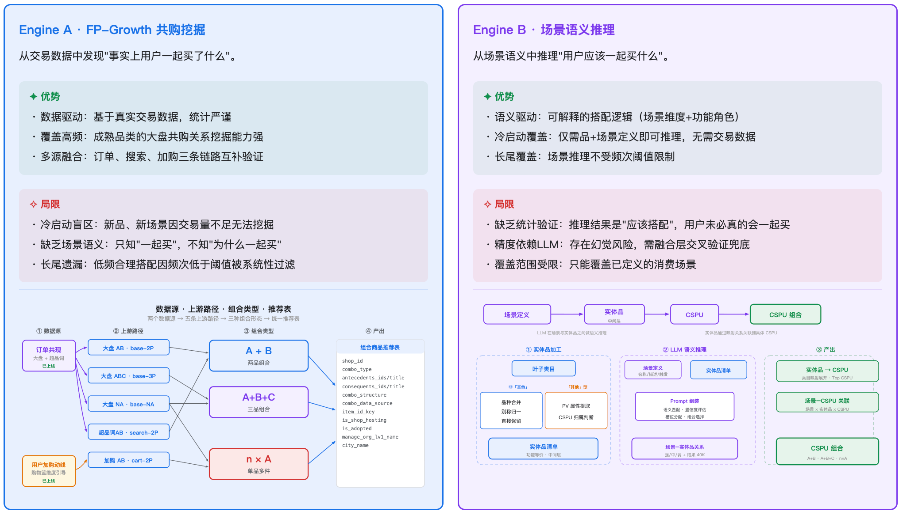 选商选品引擎：  挑战：挖掘引擎产出 644K 候选组合，实例化至门店后形成约 2 亿条建品推荐。受限于生图（商品素材制作）预算，无法全量建品。核心难点在于：如何从 2 亿条数据中精准筛选出"高曝光、高动销"的黄金组合，在严格控量（规模约束）的前提下最大化单店产出（精度追求），传统静态规则已无法满足动态平衡需求。  方案：打造"自主决策、人工反馈、持续进化"的选商选品AGENT 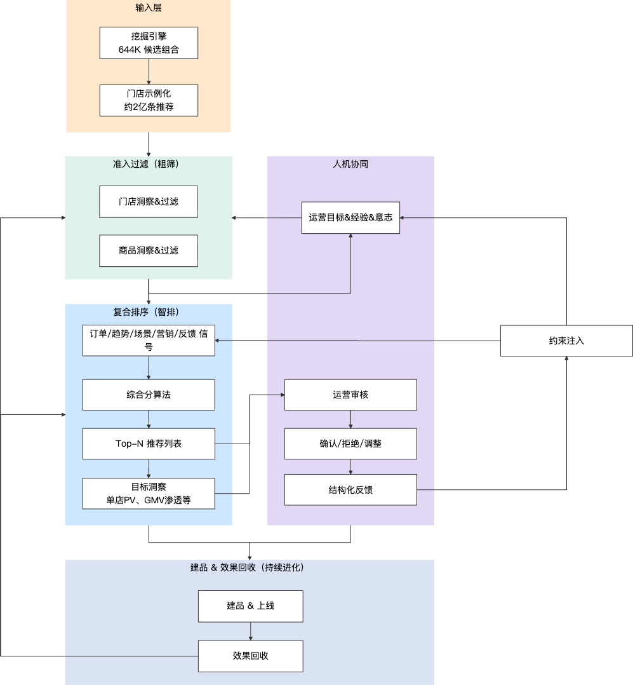 | Phase1（已完成）：基于FP-Growth的基础盘挖掘，场景资产沉淀 Phase2（7月）:  场景组合品挖掘：场景组合品挖掘上线，选优组合品场景覆盖  选商选品AGENT：人机协同 Agent v1：准入过滤 + 综合分排序；  效果闭环：全链路效果回收；曝光率 / 动销率按 org 可度量；GREEN / RED 信号回流 |
| 流量全景诊断 | 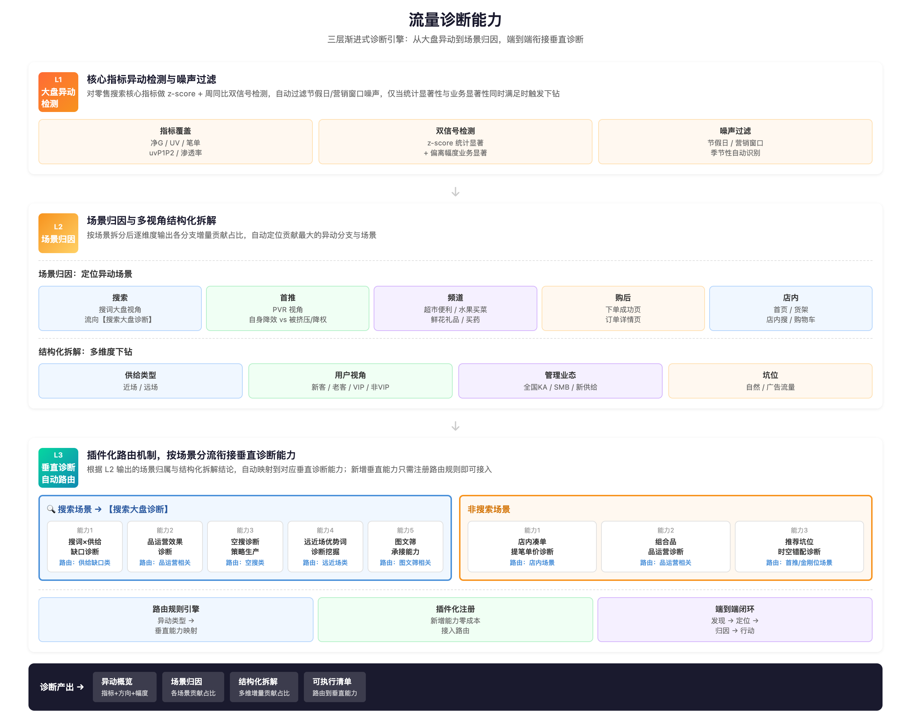 | L1 大盘异动检测引擎  挑战：零售核心指标受节假日、营销窗口、季节性等多重噪声干扰，直接看波动率会产生大量误报，人工过滤成本高  方案：对核心指标做 z-score + 周同比双信号检测，内置节假日/营销窗口自动识别与噪声过滤机制；异动信号需同时满足统计显著性（z-score 超阈值）和业务显著性（绝对偏离幅度超阈值）才触发下钻，避免"统计显著但业务无感"的无效告警 L2 场景归因与多视角结构化拆解  挑战：流量异动可能来自搜索、首推、频道、购后、店内等多个场景，且每个场景的归因视角不同（搜索多看搜词大盘、首推多看PVR、其他场景各有拆分视角）  方案：按照场景逐层输出各分支的增量贡献占比，自动识别贡献最大的异动分支 L3 垂直诊断自动路由与衔接  方案：设计插件化路由机制，根据L2输出自动分流；新增垂直能力只需注册路由规则即可接入  效果：形成"发现→定位→归因→行动"完整闭环，诊断链路端到端自动化 | P0 验证期：核心链路跑通，证明渐进式诊断可行 • L1 大盘异动检测上线，覆盖核心指标，节假日/营销窗口噪声过滤生效 • L2 场景漏斗下钻 MVP 上线，支持首推、频道场景拆分与贡献占比输出 • L2 结构化拆解 MVP 上线，支持常用维度下钻 • 搜索场景对接【搜索大盘诊断】，完成诊断和能力的衔接 • 验证标准：异动检测准确率≥x% P1 增强期：非搜索场景补齐，路由机制完善 • L2 补齐各场景专属视角 • L3 非搜索场景路由上线，完成与非搜索垂直能力的衔接（店内凑单/组合品/推荐坑位） • L3 插件化路由机制完善，支持新增垂直能力零成本接入 P2 推广期：Skill 封装，标准化诊断产出 • 三层渐进式诊断框架封装为标准化 skill，支持自动产出完整诊断及能力路由报告 |

## 六、零售专项AI化演进（Data Agent 专项推进）

三个阶段的演进：**L1 数据语义化（Data as Semantic Assets）-> L2 数据能力化（Data as Skills）-> L3 数据智能化（Data as Agentic）**

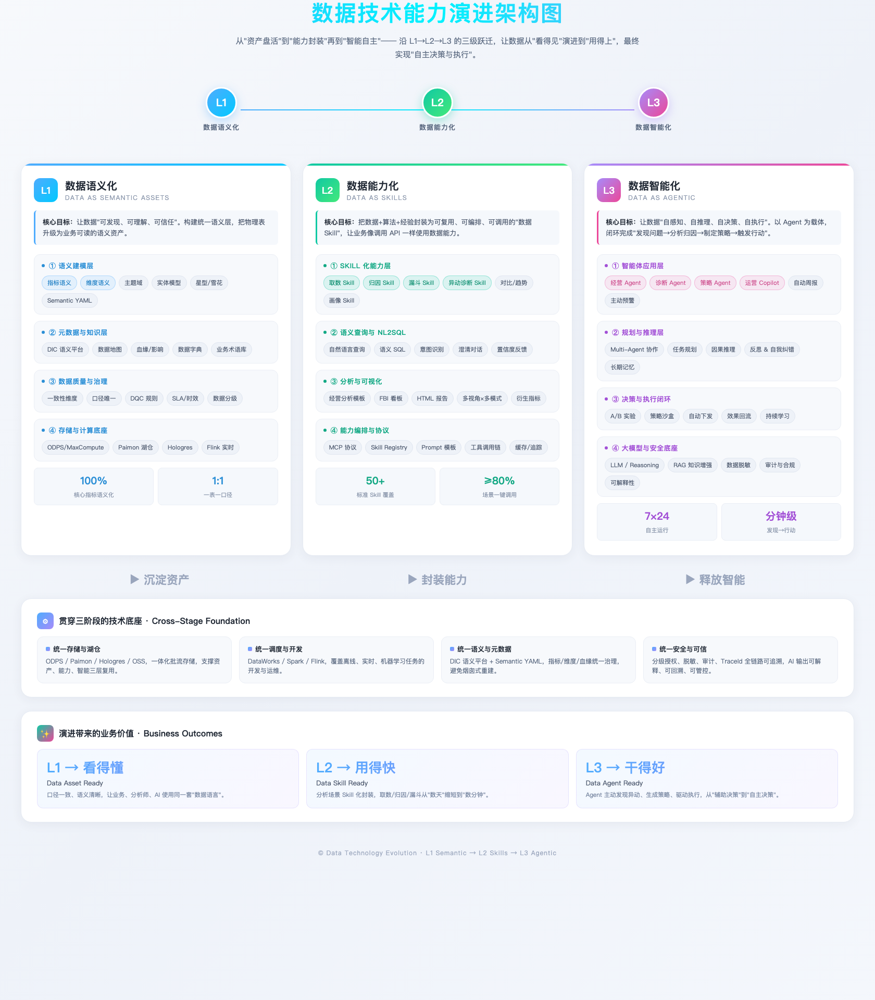
